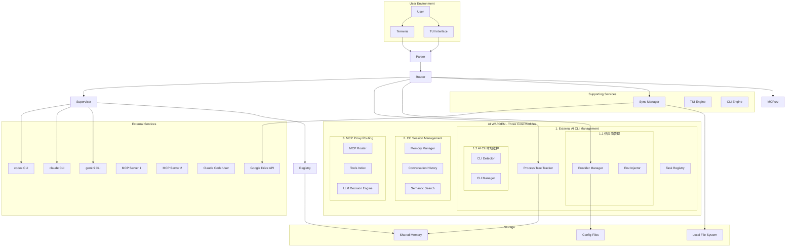
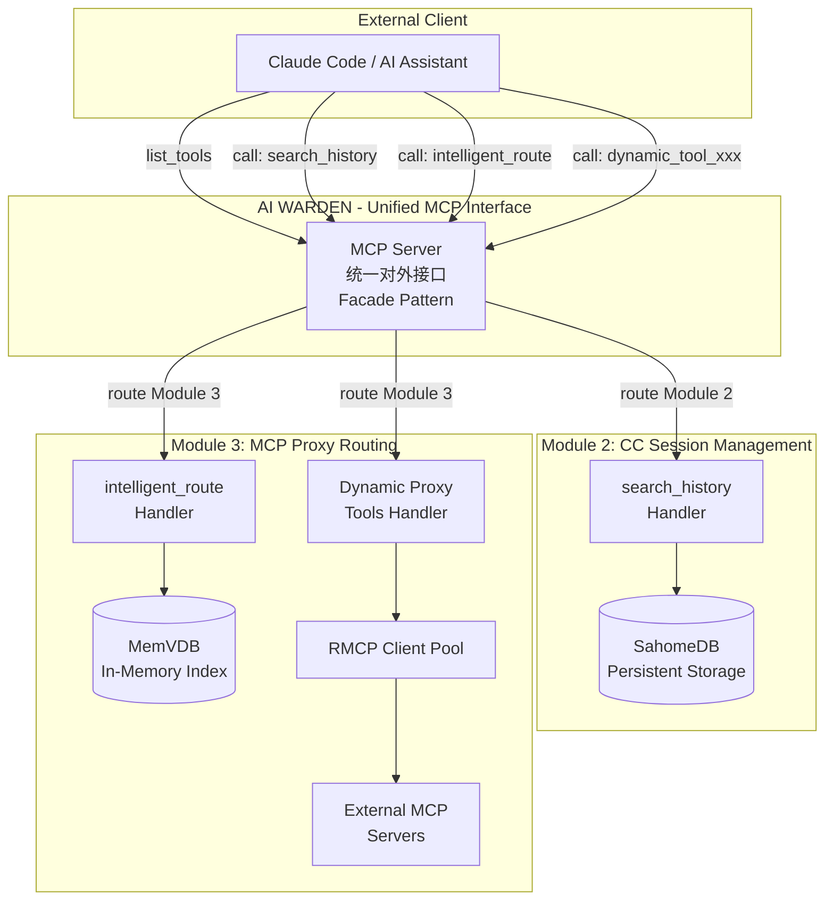
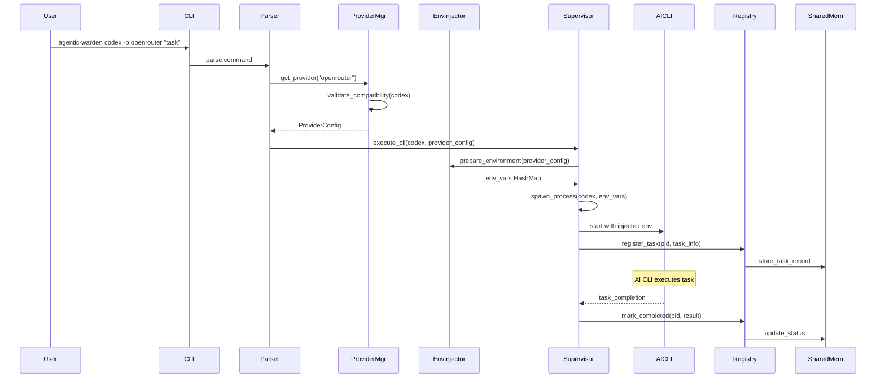
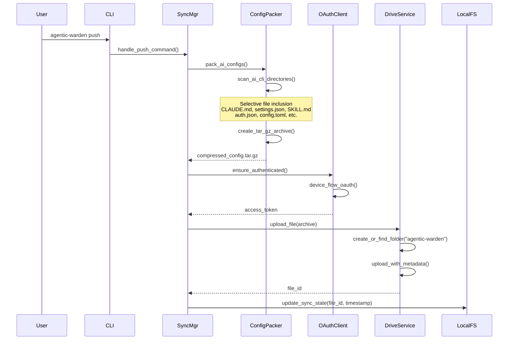
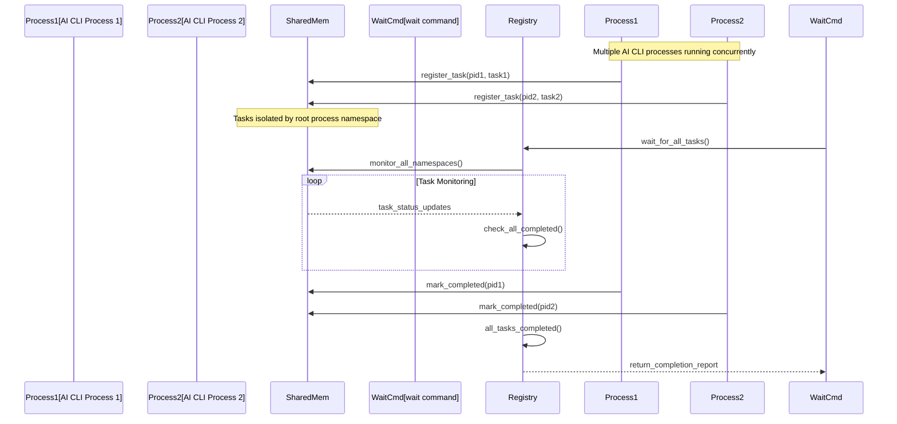
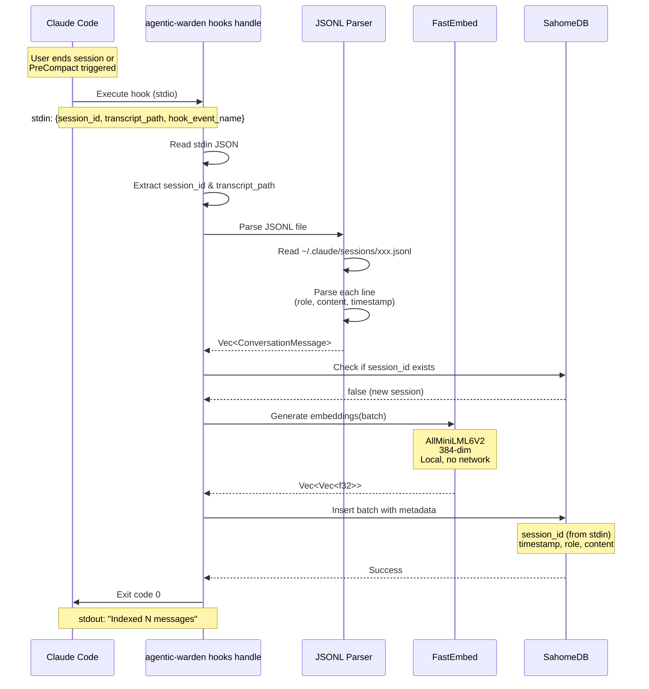
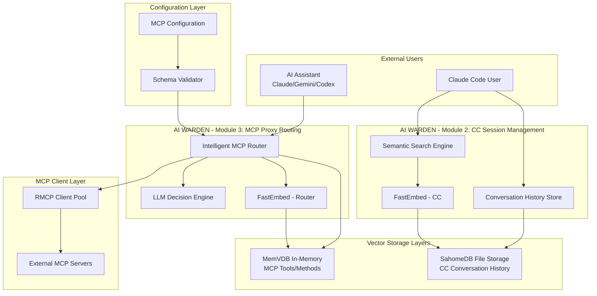
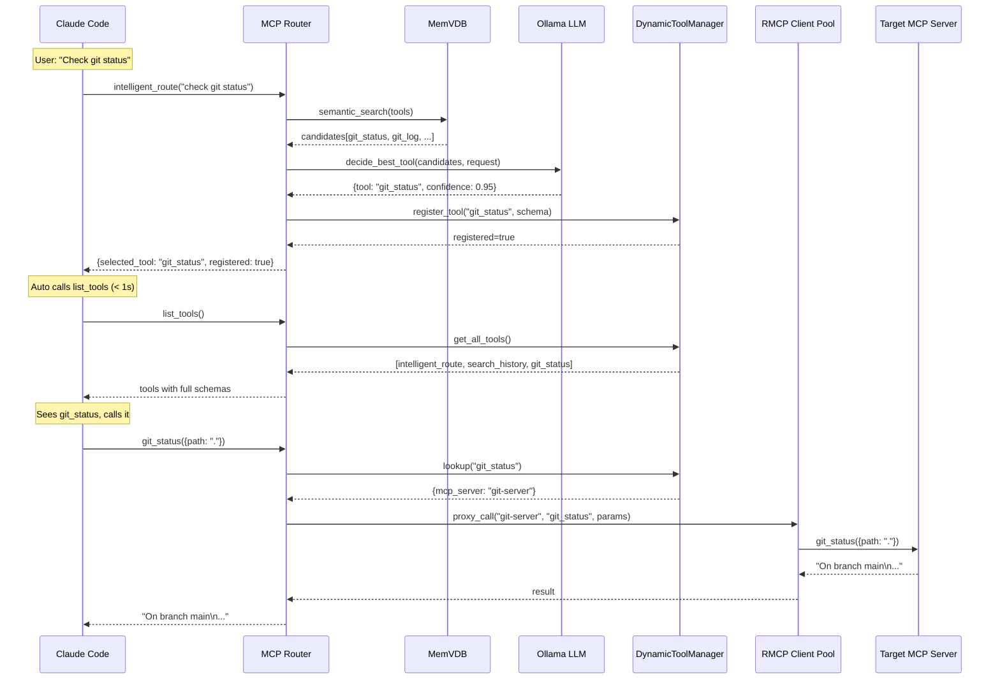
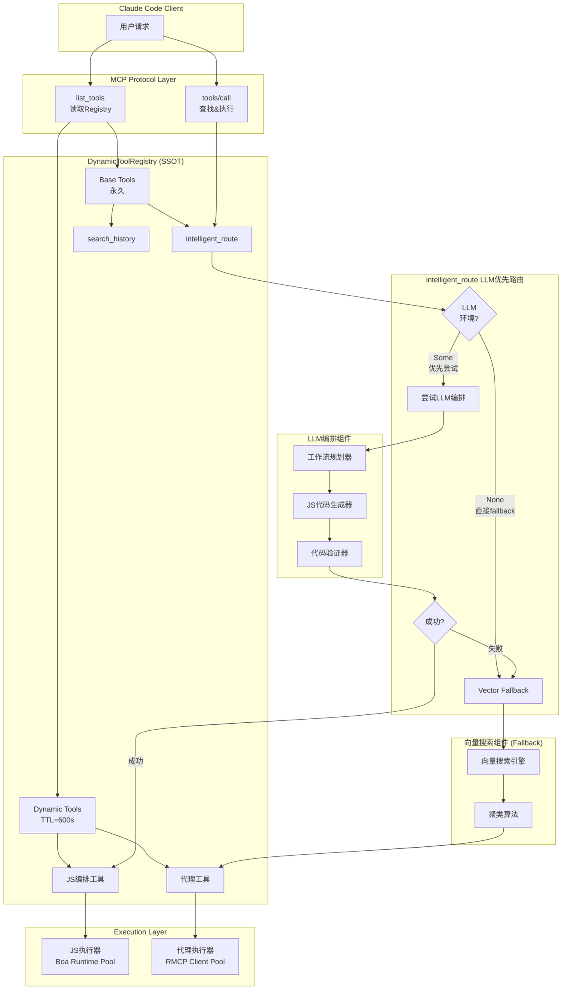

# System Architecture Design - v0.1.0

## Version Information
- Current architecture version: v0.1.0
- Last updated: 2025-11-14
- Based on: Initial development

---

## [v0] Current Architecture Overview

### System Context Diagram



### Three Core Modules Architecture

#### Module Independence and Relationships

AI WARDEN的三大核心模块在功能上相互独立，各自服务于不同的业务场景：

##### Module 1: External AI CLI Management
**服务对象**: AI CLI用户和开发者
**主要职责**:
- 管理外部AI CLI工具（Claude、Gemini、Codex等）的生命周期
- 提供商配置管理和环境变量注入
- 跨进程任务跟踪和状态监控
- 多AI CLI并发执行协调

**子模块1.1: 供应商管理 (Provider Management)**
**核心功能**:
- **供应商配置管理**: 支持多供应商配置和环境变量管理
- **多供应商支持**: OpenRouter、Anthropic、Google、DeepSeek等第三方API供应商
- **环境变量注入**: 动态注入`OPENAI_API_KEY`、`OPENAI_BASE_URL`等环境变量到AI CLI进程
- **兼容性验证**: 检查供应商与AI CLI类型的兼容性（如OpenRouter支持codex、claude、gemini）
- **默认供应商机制**: 支持设置全局默认供应商，可通过`-p`参数覆盖
- **健康检查**: 定期检查供应商连接状态（可选，间隔300秒）
- **敏感信息保护**: API Key等敏感值在日志和TUI中自动脱敏显示

**关键组件**:
- `ProviderManager`: 供应商管理核心逻辑
- `ProviderConfig`: 供应商配置结构定义
- `EnvInjector`: 环境变量注入器
- `EnvMapping`: AI CLI到环境变量的映射规则

**子模块1.2: AI CLI本地维护 (AI CLI Maintenance)**
**核心功能**:
- **自动检测**: 检测本地已安装的AI CLI工具（通过PATH查找和npm全局包检测）
- **版本管理**: 识别AI CLI版本（原生二进制 vs NPM包）
- **安装状态监控**: 实时检查AI CLI可执行文件的可用性
- **安装建议**: 对未安装的AI CLI提供安装命令提示（如`npm install -g @google/gemini-cli`）
- **更新检测**: 检查AI CLI是否有新版本可用（可选功能）
- **可执行路径定位**: 记录并缓存AI CLI的完整可执行路径
- **TUI状态展示**: 在TUI界面展示所有AI CLI的安装状态、版本、路径

**关键组件**:
- `CliToolDetector`: AI CLI检测和识别
- `CliType`: AI CLI类型枚举（Claude、Codex、Gemini）
- `CliManager`: AI CLI生命周期管理
- `StatusScreen`: TUI状态展示界面

**数据流**:
```
用户命令 → CLI解析 → [供应商管理: 加载配置+注入环境变量]
        → [AI CLI维护: 检测可执行文件] → AI CLI启动 → 进程监控 → 任务完成
```

##### Module 2: CC Session Management
**服务对象**: Claude Code用户
**主要职责**:
- 存储Claude Code的JSONL格式对话历史
- 基于向量嵌入的语义搜索
- session_id分组的会话管理
- 提供历史对话检索MCP工具

**数据流**:
```
Claude Code会话 → JSONL存储 → 向量化 → 语义索引 → 搜索检索 → 上下文返回
```

##### Module 3: MCP Proxy Routing
**服务对象**: AI助手（Claude/Gemini/Codex）
**主要职责**:
- MCP服务器工具的向量化索引
- 智能工具选择和路由决策
- 两阶段搜索算法（工具级→方法级）
- 统一的MCP接口对外提供服务

**数据流**:
```
AI助手请求 → 语义搜索 → 工具聚类 → LLM决策 → 工具执行 → 结果返回
```

#### MCP Server对外接口 (跨模块统一暴露)

AI WARDEN通过**单一MCP Server**对外暴露工具,但工具来自不同的功能模块:

| 工具名 | 所属模块 | 功能描述 | 数据存储 | 服务对象 |
|-------|---------|---------|---------|---------|
| `search_history` | Module 2: CC Session Management | 语义搜索Claude Code历史对话 | SahomeDB (持久化) | Claude Code用户 |
| `intelligent_route` | Module 3: MCP Proxy Routing | 智能选择和路由到最佳MCP工具 | MemVDB (内存) | AI助手 |
| 动态代理工具 | Module 3: MCP Proxy Routing | 按需注册,代理到外部MCP服务器 | - | AI助手 |

**架构模式**: Facade Pattern
- **统一入口**: 单一MCP Server进程对外提供服务
- **内部路由**: 根据工具名路由到对应模块的handler
- **模块解耦**: 各模块独立实现,通过接口协作
- **动态扩展**: Module 3支持运行时动态注册新工具

**MCP对外接口层架构**:



**关键设计决策**:
1. **为什么单一MCP Server而非多MCP进程?**
   - 减少Claude Code配置复杂度(只需配置一个MCP服务器)
   - 统一管理连接和生命周期
   - 便于跨模块数据共享(如会话上下文)

2. **为什么跨模块暴露工具?**
   - 用户视角: 统一的MCP工具集,无需关心内部模块划分
   - 实现视角: 模块内聚,各自管理独立的数据和逻辑
   - 扩展性: 未来可无缝添加新模块的工具

#### Module Integration Points

虽然三大模块功能独立，但通过以下方式进行协作：

1. **进程管理模块**为其他模块提供进程隔离和资源管理
2. **会话管理模块**(Module 2)通过统一MCP接口向用户提供历史检索服务(`search_history`)
3. **路由模块**(Module 3)通过统一MCP接口为AI助手提供智能工具选择能力(`intelligent_route`及动态代理工具)

### Core Business Flows

#### 1. Provider-Based AI CLI Execution Flow



#### 2. Google Drive Configuration Synchronization Flow



#### 3. Cross-Process Task Coordination Flow



---

## Technology Stack

### [v0] Current Technology Stack
**Version**: v0.1.0+

#### Core Platform
- **Language**: Rust 2021 Edition (1.70+)
- **Async Runtime**: tokio 1.0+ (rt-multi-thread, macros, signal, process)
- **Error Handling**: thiserror 1.0+ + custom error categories

#### User Interface
- **TUI Framework**: ratatui 0.26+ (all-widgets, serde)
- **Terminal Control**: crossterm 0.28+ (event-stream)
- **Graphics**: plotters 0.3 + plotters-bitmap 0.3
- **Color Themes**: color-eyre 0.6

#### Data & Serialization
- **Serialization**: serde 1.0+ (derive) + serde_json 1.0+
- **Configuration**: config 0.14+ (toml, json, yaml) + confy 0.6
- **Binary Formats**: bincode 1.3 + rmp-serde 1.1 (MessagePack)

#### Inter-Process Communication
- **Shared Memory**: shared_memory 0.12 + shared_hashmap 0.1.2
- **Synchronization**: raw_sync 0.1.5 + parking_lot 0.12
- **Process Management**: tokio::process + platform-specific APIs

#### Platform Abstraction
- **Windows**: windows 0.54 (Win32 APIs) + sysinfo 0.32
- **Unix**: psutil 3.2 + nix 0.29 (signal, process) + libc 0.2

#### External Integrations
- **HTTP Client**: reqwest 0.12+ (json, multipart, cookies)
- **Google APIs**: yup-oauth2 8.3 + mime_guess 2.0
- **MCP Protocol**: rmcp 0.5 (server, transport-io, macros)
- **File Operations**: tar 0.4 + flate2 1.0 + walkdir 2.5

#### Development & Testing
- **CLI Parsing**: clap 4.4+ (derive)
- **Testing**: mockall 0.12 + tokio-test 0.4 + wiremock 0.6
- **Logging**: tracing 0.1 + tracing-subscriber 0.3

---

## Architecture Decision Records (ADR)

### ARCH-001: Shared Memory-Based Task Coordination
**Date**: 2025-11-08
**Status**: 🟢 Adopted
**Version**: v0.1.0
**Related Requirements**: REQ-001, REQ-005

#### Background
Agentic-Warden needs to coordinate tasks across multiple AI CLI processes while maintaining isolation and preventing interference. Traditional approaches like process polling or HTTP APIs would introduce latency and complexity.

#### Decision
Use shared memory with namespacing for cross-process task coordination and real-time status tracking.

#### Options Compared
| Approach | Pros | Cons | Performance |
|----------|------|------|-------------|
| **Shared Memory** | <1ms operations, real-time updates, OS-level isolation | Manual cleanup required, platform-specific APIs | **Excellent** (< 1ms) |
| HTTP API | Cross-platform, easy debugging | Network latency, requires service management | Good (10-50ms) |
| File-based IPC | Simple implementation | Slow I/O, file locking complexity | Poor (100+ms) |
| Message Queue | Reliable delivery, scalability | External dependency, complexity | Good (5-20ms) |

#### Rationale
- **Performance Critical**: Task status updates need to be real-time for `wait` command responsiveness
- **Process Isolation**: Shared memory provides OS-level isolation between different AI CLI root processes
- **No External Dependencies**: Self-contained solution doesn't require additional services
- **Cross-Platform**: All target platforms (Windows/Linux/macOS) support shared memory

#### Impact
- **Performance**: Sub-millisecond task status updates and coordination
- **Complexity**: Increased implementation complexity for shared memory management
- **Reliability**: Requires robust cleanup mechanisms to prevent memory leaks
- **Testing**: Complex to test due to concurrency and platform-specific behavior

#### Implementation Details
```rust
// Namespace isolation by AI CLI root process
pub const NAMESPACE_FORMAT: &str = "agentic-warden-{pid}_task";

// Shared memory layout
pub struct TaskRecord {
    pub pid: u32,
    pub root_parent_pid: u32,
    pub prompt: String,
    pub status: TaskStatus,
    pub start_time: DateTime<Utc>,
    pub provider: Option<String>,
}

// Access pattern
pub enum TaskStatus {
    Running,
    CompletedButUnread,
    Completed,
}
```

---

### ARCH-002: Environment Variable Injection for Provider Management
**Date**: 2025-11-08
**Status**: 🟢 Adopted
**Version**: v0.1.0
**Related Requirements**: REQ-002

#### Background
Users need to switch between different API providers (OpenRouter, LiteLLM, official APIs) without modifying AI CLI native configuration files. The solution must be transparent to AI CLI processes and support dynamic switching.

#### Decision
Use environment variable injection at process startup time to dynamically configure AI CLI processes with provider-specific settings.

#### Options Compared
| Approach | Pros | Cons | User Experience |
|----------|------|------|-----------------|
| **Env Variable Injection** | Transparent to AI CLI, no config file modification, dynamic switching | Process-level only, requires restart | **Excellent** (seamless) |
| Config File Patching | Persistent changes, works with restarts | Risk of corrupting native configs, conflicts | Poor (destructive) |
| Proxy Service | Language-agnostic, centralized control | Network dependency, latency | Good (transparent) |
| CLI Wrapper Scripts | Simple implementation | Maintenance overhead, platform differences | Fair (manual) |

#### Rationale
- **Non-Invasive**: Doesn't modify AI CLI native configuration files
- **Dynamic**: Support `-p` parameter for per-execution provider selection
- **Universal**: Works across different AI CLI tools (codex, claude, gemini)
- **Secure**: No need to store sensitive API keys in additional locations

#### Implementation Details
```rust
// Provider configuration structure (v0.2.0 enhanced)
pub struct Provider {
    pub token: Option<String>,           // Optional API token
    pub base_url: Option<String>,        // Optional base URL
    pub scenario: Option<String>,        // [v0.2.0] Usage scenario description
    pub env: HashMap<String, String>,    // Additional environment variables
}

impl Provider {
    // [v0.2.0] Dynamic ENV injection with auto-mapping
    pub fn get_all_env_vars(&self) -> HashMap<String, String> {
        let mut env = self.env.clone();

        // Auto-map token to standard env vars
        if let Some(token) = &self.token {
            env.entry("ANTHROPIC_API_KEY".to_string())
               .or_insert(token.clone());
        }

        // Auto-map base_url to standard env vars
        if let Some(base_url) = &self.base_url {
            env.entry("ANTHROPIC_BASE_URL".to_string())
               .or_insert(base_url.clone());
        }

        env
    }
}

// Injection process
impl EnvInjector {
    pub fn inject_to_command(cmd: &mut Command, provider: &Provider) {
        for (key, value) in provider.get_all_env_vars() {
            cmd.env(key, value);  // Direct environment variable setting
        }
    }
}
```

#### Impact
- **User Experience**: Seamless provider switching with `-p` flag
- **Security**: API keys remain in provider configuration, not scattered in environment
- **Compatibility**: Works with any CLI tool that respects environment variables
- **Maintenance**: No need to track AI CLI configuration file format changes

---

### ARCH-003: Google Drive Integration with OAuth 2.0 Device Flow
**Date**: 2025-11-08
**Status**: 🟢 Adopted
**Version**: v0.1.0
**Related Requirements**: REQ-003

#### Background
Users need to backup and restore AI CLI configurations across devices. The solution must work in headless environments and support automated workflows without requiring browser interactions.

#### Decision
Use Google Drive API with OAuth 2.0 Device Flow (RFC 8628) for secure, browser-optional authentication and file operations.

#### Options Compared
| Approach | Pros | Cons | Headless Support |
|----------|------|------|------------------|
| **OAuth Device Flow** | Works in headless, standard security, no browser required | Manual copy-paste of codes | **Excellent** |
| OAuth Implicit Flow | Simpler implementation | Requires browser, security concerns | Poor |
| Service Account Keys | Fully automated | Complex setup, key management overhead | Good |
| Local Storage Only | Simple, no external deps | No cross-device sync | Not Applicable |

#### Rationale
- **Headless Compatibility**: Device flow works in SSH sessions, CI/CD, and servers
- **Security**: Standard OAuth 2.0 without storing sensitive credentials
- **User Control**: Users explicitly authorize access to specific folders
- **Automatic**: Once authorized, subsequent operations are fully automated

#### Implementation Details
```rust
// OAuth Device Flow
pub struct OAuthClient {
    pub client_id: String,
    pub auth_scope: String,
}

pub async fn device_flow_auth() -> Result<TokenInfo> {
    // 1. Request device code
    let device_code = get_device_code().await?;

    // 2. Display user instructions
    println!("Please visit: {}", device_code.verification_url);
    println!("Enter code: {}", device_code.user_code);

    // 3. Poll for token completion
    let token = poll_for_token(device_code.device_code).await?;
    Ok(token)
}
```

#### Impact
- **Security**: Industry-standard OAuth with token refresh support
- **Usability**: One-time setup, automatic thereafter
- **Compatibility**: Works across all target platforms
- **Infrastructure**: No additional server requirements

---

### ARCH-004: Selective Configuration Packing Strategy
**Date**: 2025-11-08
**Status**: 🟢 Adopted
**Version**: v0.1.0
**Related Requirements**: REQ-003

#### Background
AI CLI configurations contain a mix of essential settings, temporary files, and user-specific data. Backup must include important configuration while excluding unnecessary files to reduce size and avoid conflicts.

#### Decision
Implement selective file packing that includes only essential configuration files and explicitly excludes temporary, cache, and user-specific content.

#### Options Compared
| Approach | Pros | Cons | Backup Size |
|----------|------|------|-------------|
| **Selective Packing** | Small backup size, no conflicts, targeted | Requires maintenance of file lists | **Optimal** (~1-5MB) |
| Full Directory Backup | Complete, simple implementation | Large size, conflict risk, includes junk | Poor (100MB+) |
| User Configuration Files | Simple, respects user choices | Incomplete backup, missing essential files | Unreliable |

#### Rationale
- **Efficiency**: Reduces backup size by excluding unnecessary files
- **Reliability**: Avoids conflicts from temporary files and caches
- **Portability**: Ensures backups don't contain machine-specific data
- **Maintainability**: Explicit file lists serve as documentation

#### Implementation Details
```rust
// File inclusion strategy
impl ConfigPacker {
    // Claude: CLAUDE.md, settings.json, agents/, skills/SKILL.md
    fn pack_claude_configs(&self) -> Result<Option<(usize, u64)>> {
        let files_to_pack = [
            ("CLAUDE.md", "Main memory file"),
            ("settings.json", "Main configuration"),
        ];
        // Pack agents/ directory and SKILL.md files selectively
    }

    // Codex: auth.json, config.toml, agents.md, history.jsonl
    // Gemini: google_accounts.json, settings.json, gemini.md
}
```

#### Impact
- **Performance**: Faster upload/download due to smaller archives
- **Reliability**: Reduced risk of conflicts from machine-specific files
- **Storage**: Efficient use of Google Drive quota
- **Maintenance**: Clear documentation of essential vs. non-essential files

---

## Module Structure

### [v0] Current Module Architecture

#### Three Core System Modules

AI WARDEN的核心系统由三大功能模块组成，每个模块负责独立的业务领域：

##### 1. External AI CLI Management Module
**Responsibility**: 外部AI CLI工具的启动、监控和管理
**Core Components**:
- Process Tracking (`src/core/process_tree.rs`) - AI CLI进程识别和隔离
- Provider Management (`src/provider/`) - 第三方API提供商配置
- Task Coordination (`src/storage/`, `src/registry/`) - 跨进程任务跟踪

**Key Functions**:
- AI CLI进程启动和生命周期管理
- 提供商配置管理和环境变量注入
- 任务状态监控和进程树跟踪
- 多AI CLI并发执行协调

##### 2. CC (Claude Code) Session Management Module
**Responsibility**: Claude Code用户会话历史的存储和语义搜索
**Core Components**:
- Conversation History Storage (`src/memory/history.rs`) - SahomeDB文件数据库
- Semantic Search (`src/memory/`) - 向量化会话检索
- MCP Tools - `search_history`, `get_session_todos`

**Key Features**:
- JSONL格式会话记录存储
- 基于session_id的会话分组管理
- 语义相似度搜索历史对话
- 工具使用记录和模式分析

##### 3. MCP Proxy Routing Module
**Responsibility**: 为AI助手提供智能MCP工具选择和路由服务
**Core Components**:
- MCP Tools Indexing (`src/mcp_routing/`) - MemVDB内存向量数据库
- Intelligent Routing (`src/mcp_routing/`) - LLM辅助工具选择决策
- RMCP Client Pool (`src/mcp_routing/`) - 动态MCP服务器连接管理

**Key Features**:
- 两阶段搜索：工具级→方法级精确匹配
- 智能聚类算法和相似度阈值配置
- 自动从MCP配置重建路由索引
- 统一的MCP接口对外提供服务

##### 4. Synchronization (`src/sync/`)
**Responsibility**: Google Drive integration and configuration backup/restore
**Dependencies**: Google Drive API, OAuth client, file system
**Key Components**:
- `GoogleDriveService` - Complete Drive API operations
- `ConfigPacker` - Selective configuration archive creation
- `OAuthClient` - OAuth 2.0 Device Flow implementation

##### 5. User Interface (`src/tui/`)
**Responsibility**: Terminal-based user interface with unified design system
**Dependencies**: ratatui, crossterm
**Key Components**:
- `DashboardScreen` - AI CLI status and task overview
- `ProviderManagementScreen` - Provider configuration interface
- `ProgressScreen` - Sync operation progress display

#### Integration Points

##### 1. Supervisor Integration (`src/supervisor.rs`)
**Central coordination hub that integrates:**
- Process tracking for AI CLI identification
- Provider management for environment injection
- Task registry for lifecycle management
- Signal handling for graceful termination

##### 2. MCP Server (`src/mcp.rs`)
**External integration point providing:**
- Process monitoring tools
- Task status queries
- Provider configuration access
- AI CLI launch capabilities

---

## Security Architecture

### [v0] Security Measures

#### Authentication & Authorization
- **OAuth 2.0**: Standard Google Drive authentication with Device Flow
- **Token Management**: Secure token storage with automatic refresh
- **Scope Limitation**: Minimal Google Drive scopes for configuration backup only

#### Data Protection
- **Configuration Files**: Restricted permissions (600) on provider configurations
- **Shared Memory**: Namespace isolation prevents cross-process data leakage
- **API Keys**: Stored encrypted at rest, never logged

#### Process Isolation
- **Namespace Separation**: Each AI CLI root process has isolated shared memory namespace
- **Privilege Separation**: No unnecessary privileges requested
- **Signal Handling**: Clean process termination without resource leaks

#### Network Security
- **HTTPS Only**: All external communications use TLS
- **Certificate Validation**: Proper certificate chain verification
- **Proxy Support**: Secure proxy configuration for enterprise environments

---

## Performance Architecture

### [v0] Performance Characteristics

#### Benchmarks & Metrics
- **Process Detection**: < 100ms for 100 processes
- **Task Registration**: < 1ms per operation (shared memory)
- **TUI Rendering**: < 16ms per frame (60 FPS)
- **Configuration Sync**: 1-5MB archives, 10-30s typical sync

#### Scalability Considerations
- **Concurrent Tasks**: Supports 50+ concurrent AI CLI processes
- **Memory Usage**: < 50MB baseline + shared memory for task tracking
- **Storage Growth**: Linear with active tasks, automatic cleanup
- **Network Usage**: Minimal, only during configuration sync operations

#### Optimization Strategies
- **Caching**: Process tree detection results cached for 5 seconds
- **Batching**: Shared memory operations batched to reduce syscalls
- **Lazy Loading**: TUI components loaded on-demand
- **Compression**: GZIP compression for configuration archives

---

## Deployment Architecture

### [v0] Deployment Model

#### Installation Methods
- **Cargo Install**: `cargo install agentic-warden` (crates.io)
- **Binary Release**: Pre-compiled binaries for Windows/Linux/macOS
- **Package Managers**: Homebrew, Scoop, AUR community packages

#### Configuration Management
- **User Directory**: `~/.aiw/` for persistent configuration
- **Runtime Directory**: System temp directory for temporary files
- **Shared Memory**: OS-managed shared memory segments
- **No System Dependencies**: Self-contained, no root privileges required

#### Upgrade Strategy
- **Backward Compatibility**: Configuration format versioning with migration
- **Graceful Migration**: Automatic backup during major version upgrades
- **Rollback Support**: Configuration archives for rollback scenarios

---

### ARCH-010: Claude Code会话历史Hook集成架构
**Date**: 2025-11-14
**Status**: 🟢 Done
**Version**: v0.2.0
**Related Requirements**: REQ-010

#### Background
Claude Code provides hooks mechanism for session lifecycle events. We need to capture conversation history automatically without manual CLI commands, enabling seamless semantic search via MCP tools.

#### Decision
Use Claude Code's `SessionEnd` and `PreCompact` hooks to trigger automatic conversation history ingestion into vector database.

#### Options Compared
| Approach | Pros | Cons | User Experience |
|----------|------|------|-----------------|
| **Hook-based (Selected)** | Automatic, zero user effort, real-time | Requires Claude Code setup | **Excellent** (invisible) |
| Manual CLI import | Simple, no dependencies | User must remember to run | Poor (friction) |
| File watcher | Automatic detection | Complex, resource-heavy | Good (automatic) |
| Periodic cron job | Scheduled, reliable | Delayed ingestion, overhead | Fair (not real-time) |

#### Rationale
- **Zero Friction**: Users configure hooks once, then forget about it
- **Real-Time**: Conversations indexed immediately after session ends
- **Native Integration**: Leverages Claude Code's official hook mechanism
- **Session Context**: Hook provides session_id directly from stdin
- **Idempotent**: Can re-run on same session without duplicates

#### Architecture Diagram



#### Component Design

```rust
// Hook input from Claude Code (stdin)
#[derive(Deserialize)]
struct ClaudeCodeHookInput {
    session_id: String,           // From hook stdin
    transcript_path: String,      // JSONL file path
    hook_event_name: String,      // "SessionEnd" | "PreCompact"
    cwd: Option<String>,
    permission_mode: Option<String>,
}

// JSONL parser for Claude Code format
pub struct ClaudeCodeTranscriptParser;

impl ClaudeCodeTranscriptParser {
    pub fn parse_file(path: &Path) -> Result<Vec<ConversationMessage>> {
        // Stream parse JSONL
        // Extract role, content, timestamp from each line
    }
}

// Hook handler orchestrator
pub struct HookHandler {
    parser: ClaudeCodeTranscriptParser,
    embedder: FastEmbedGenerator,
    store: ConversationHistoryStore,
}

impl HookHandler {
    pub async fn handle_from_stdin() -> Result<()> {
        // 1. Read stdin JSON
        let input: ClaudeCodeHookInput = serde_json::from_reader(std::io::stdin())?;

        // 2. Check if already processed
        if self.store.has_session(&input.session_id).await? {
            eprintln!("Session {} already indexed, skipping", input.session_id);
            return Ok(());
        }

        // 3. Parse JSONL transcript
        let messages = self.parser.parse_file(&input.transcript_path)?;

        // 4. Generate embeddings (batch of 10)
        let embeddings = self.embedder.generate_batch(
            messages.iter().map(|m| &m.content).collect()
        ).await?;

        // 5. Store with session_id from stdin
        for (msg, embedding) in messages.iter().zip(embeddings) {
            let record = ConversationRecord {
                id: Uuid::new_v4().to_string(),
                session_id: Some(input.session_id.clone()),  // From stdin!
                role: msg.role.clone(),
                content: msg.content.clone(),
                timestamp: msg.timestamp,
                tools_used: vec![],
            };
            self.store.append(record, embedding).await?;
        }

        println!("✅ Indexed {} messages for session {}", messages.len(), input.session_id);
        Ok(())
    }
}
```

#### Data Flow

| Stage | Component | Input | Output | Performance |
|-------|-----------|-------|--------|-------------|
| **Hook Trigger** | Claude Code | Session ends | Executes hook command | Instant |
| **Stdin Read** | Hook CLI | JSON from stdin | ClaudeCodeHookInput | < 1ms |
| **JSONL Parse** | Parser | transcript_path file | Vec<ConversationMessage> | 10ms per 1000 lines |
| **Dedup Check** | SahomeDB | session_id | boolean (exists?) | < 20ms |
| **Embedding** | FastEmbed | Batch of messages | Vec<Vec<f32>> (384-dim) | 10ms per 10 messages |
| **Vector Insert** | SahomeDB | Records + embeddings | Success | 5ms per 10 records |
| **Hook Exit** | Hook CLI | - | Exit code 0 | Instant |

**Total Time**: < 2s for typical session (100 messages)

#### Impact
- **User Experience**: Completely transparent, zero manual intervention
- **Data Freshness**: Conversations available for search immediately after session
- **Resource Usage**: Minimal (FastEmbed local, no network calls)
- **Reliability**: Idempotent design prevents duplicate entries
- **Integration**: Native Claude Code hooks, no polling or file watchers

---

## [v0] Intelligent MCP Routing Architecture

### ARCH-012: 智能MCP路由系统架构设计

#### System Context Integration



#### Module Independence

**重要说明**: CC会话管理模块与MCP路由模块在功能上完全独立：

- **CC会话管理**: 服务于Claude Code用户，存储和检索历史对话
- **MCP路由模块**: 服务于AI助手，智能选择和调用MCP工具
- **无直接依赖**: 两个模块使用独立的向量存储和嵌入服务
- **独立数据流**: 各自有不同的服务对象和数据用途

#### Component Architecture Details

##### 1. Intelligent MCP Router (Module 3 Core Component)
- **Purpose**: Meta-MCP gateway with dynamic tool registration architecture
- **Module 3提供的MCP工具**: `intelligent_route` (智能路由工具选择和动态注册)
- **Note**: `search_history`工具由Module 2提供,与此组件独立(详见前文"MCP Server对外接口"章节)
- **Key Mechanism**: Leverages Claude Code's automatic `list_tools` refresh (< 1s before each tool use)
- **Internal Components**:
  - Vector search engine (FastEmbed + MemVDB)
  - LLM decision engine (Ollama)
  - DynamicToolManager (thread-safe global tools registry)
  - RMCP client pool (proxy to target MCP servers)

##### 2. Dual-Mode Vector Database Layer
- **MemVDB (In-Memory)**:
  - Collections: `mcp_tools`, `mcp_methods`
  - Purpose: Fast MCP routing index, rebuilt on startup from mcp.json
  - Features: Thread-safe, cosine similarity, batch operations
  - Lifecycle: Memory-only, destroyed on shutdown
  - Rebuild: Automatically reconstructed from MCP configuration

- **SahomeDB (File-based Persistent)**:
  - Collections: `conversation_history`
  - Purpose: Claude Code conversation history storage and semantic search
  - Features: Persistent file storage, zero external dependencies, semantic search
  - Integration: New conversation history management module
  - Data: Session metadata, conversation context, tool usage patterns

##### 3. RMCP Client Connection Pool
- **Purpose**: Dynamic MCP server lifecycle management
- **Features**: Health monitoring, auto-reconnection, concurrent operations
- **Isolation**: Proper process isolation and resource management
- **Discovery**: Automatic tool schema discovery and caching

##### 4. LLM Decision Engine
- **Purpose**: Intelligent tool/method selection using semantic understanding
- **Integration**: Ollama service with configurable endpoints
- **Models**: qwen3:1.7b (default), configurable via environment
- **Capabilities**: Clustering analysis, ambiguity handling, confidence scoring

#### Data Flow Architecture (Dynamic Tool Registration)



#### Technology Stack Integration

##### New Dependencies for ARCH-012:
- `fastembed` = "4.0.0" # Local text embedding generation
- `memvdb` = "0.1.1" # In-memory vector database for MCP routing (pure Rust, zero deps)
- `sahomedb` = "0.4.0" # File-based vector database for conversation history
- `rmcp` = { version = "0.5", features = ["client", "server", "transport-io", "transport-child-process", "macros"] } # MCP client functionality
- `ollama-rs` = "0.3.1" # LLM communication (retained for tool selection decisions)
- `ndarray` = { version = "0.15", features = ["serde"] } # Vector calculations (FastEmbed dependency)

##### Existing Component Integration:
- **Memory Module**: Refactored to use FastEmbed embeddings + SahomeDB for conversation history
- **Configuration System**: Extends mcp.json validation and management
- **Process Supervisor**: Integrates with MCP server lifecycle management
- **Embedding Service**: Replaced Ollama-based embedding with FastEmbed local generation

#### Performance Architecture

##### Key Performance Targets:
- **Tool Discovery**: < 50ms for typical semantic queries (MemVDB + FastEmbed)
- **Method Routing**: < 200ms end-to-end including LLM decisions
- **Embedding Generation**: < 30ms local (FastEmbed vs 200-500ms network)
- **Vector Search**: < 10ms for MemVDB operations, < 150ms for SahomeDB
- **Conversation History Search**: < 200ms for semantic queries
- **MCP Connections**: Support 10+ concurrent client connections
- **Memory Usage**: < 50MB for MemVDB index, < 200MB for SahomeDB storage
- **Startup Time**: < 500ms for MemVDB index reconstruction from mcp.json

##### Scalability Considerations:
- **Horizontal Scaling**: Multiple MCP server connections
- **Memory Management**: Efficient MemVDB data structures, automatic cleanup
- **Caching Strategy**: Route result caching with TTL-based invalidation
- **Load Balancing**: Connection pool distribution and health-based routing

---

### ARCH-013: 动态JS编排工具系统架构
**Date**: 2025-11-15
**Status**: 🟢 Adopted
**Version**: v0.2.0
**Related Requirements**: REQ-013, ARCH-012

#### Background

intelligent_route当前通过向量搜索选择单个MCP工具,对于复杂多步骤任务效率低下。通过引入Boa JS引擎和LLM驱动的代码生成,我们可以动态创建组合多个MCP工具的编排函数,一次调用完成复杂工作流。

#### Decision

使用DynamicToolRegistry作为MCP工具定义的SSOT,配合Boa JS引擎和LLM代码生成能力,实现intelligent_route的双模式路由(LLM编排 vs 向量搜索)。

#### Architecture Overview



#### Core Components Design

##### 1. DynamicToolRegistry

**数据结构**:
```rust
pub struct DynamicToolRegistry {
    // 基础工具(启动时初始化,永久存在)
    base_tools: HashMap<String, BaseToolDefinition>,

    // 动态工具(运行时注册,带TTL)
    dynamic_tools: Arc<RwLock<HashMap<String, RegisteredTool>>>,

    config: RegistryConfig,
}

pub struct RegistryConfig {
    default_ttl_seconds: u64,      // 默认TTL = 600秒(10分钟)
    max_dynamic_tools: usize,       // 最大100个动态工具
    cleanup_interval_seconds: u64,  // 清理间隔60秒
}

pub enum RegisteredTool {
    JsOrchestrated(JsOrchestratedTool),  // JS编排工具
    ProxiedMcp(ProxiedMcpTool),          // 代理MCP工具
}
```

**关键操作**:
- `register_js_tool()`: 注册JS编排工具
- `register_proxied_tools()`: 批量注册代理工具
- `get_all_tool_definitions()`: list_tools读取所有工具
- `get_tool()`: tools/call查找工具定义
- `cleanup_expired_tools()`: 后台清理过期工具

**TTL管理**:
```rust
// 后台清理任务
tokio::spawn(async move {
    let mut interval = tokio::time::interval(Duration::from_secs(60));
    loop {
        interval.tick().await;
        registry.cleanup_expired_tools().await;
    }
});
```

**关键架构设计 - base_tools vs dynamic_tools双层结构**:

**设计理念**:
- **base_tools (永久工具)**: 来自mcp.json配置文件定义的MCP服务器工具,启动时通过warm_up()一次性扫描并永久驻留内存,无TTL限制
- **dynamic_tools (临时工具)**: 运行时LLM动态生成的JS编排工具,带TTL=600秒,最多100个,LRU驱逐策略

**数据结构优化**:
```rust
pub struct DynamicToolRegistry {
    // 永久工具 (来自mcp.json)
    base_tools: HashMap<String, BaseToolDefinition>,
    base_snapshot: Arc<Vec<Tool>>,  // ✅ Arc共享,避免重复clone

    // 临时工具 (LLM运行时生成)
    dynamic_tools: Arc<RwLock<HashMap<String, RegisteredTool>>>,  // ✅ TTL管理

    // list_tools缓存
    tool_cache: Arc<RwLock<Option<Arc<Vec<Tool>>>>>,  // ✅ Arc嵌套,零拷贝
}
```

**启动时构建流程 (仅一次)**:
```rust
// src/mcp_routing/mod.rs:100-105
pub async fn initialize() -> Result<Self> {
    // 1. 一次性warm_up所有MCP服务器
    let discovered = connection_pool.warm_up().await?;  // ✅ 扫描mcp.json

    // 2. 构建向量索引 (MemVDB内存数据库)
    let embeddings = build_embeddings(&embedder, &discovered, config)?;
    index.rebuild(&embeddings.tools, &embeddings.methods)?;  // ✅ <500ms启动

    // 3. 填充永久工具注册表
    populate_registry(&tool_registry, discovered).await;  // ✅ base_tools固化

    // 4. 创建动态工具注册表(初始为空)
    let dynamic_registry = Arc::new(DynamicToolRegistry::new(Vec::new()));
}
```

**list_tools性能优化 (Arc共享)**:
```rust
// src/mcp_routing/registry.rs:331-352
pub async fn get_all_tool_definitions(&self) -> Arc<Vec<Tool>> {
    // 缓存命中: 直接返回Arc指针,零拷贝
    if let Some(cached) = self.tool_cache.read().await.clone() {
        return cached;  // ✅ Arc clone只复制指针,<1μs
    }

    // 缓存失效: 快速重建
    let mut snapshot = Vec::new();
    snapshot.extend(self.base_snapshot.iter().cloned());  // ✅ Arc浅拷贝,<1ms

    let map = self.dynamic_tools.read().await;
    for entry in map.values() {
        snapshot.push(entry.tool().clone());  // ✅ 只clone动态工具(≤100个)
    }

    let arc_snapshot = Arc::new(snapshot);
    *self.tool_cache.write().await = Some(arc_snapshot.clone());
    arc_snapshot  // ✅ 返回Arc,后续list_tools直接复用
}
```

**架构优势总结**:

| 维度 | base_tools | dynamic_tools | 性能影响 |
|------|-----------|---------------|---------|
| **来源** | mcp.json配置文件 | LLM运行时生成 | - |
| **生命周期** | 启动时构建,永久存在 | TTL=600s,自动过期 | 避免重启重新扫描 |
| **数量限制** | 无限制(取决于MCP服务器数量) | 最多100个,LRU驱逐 | 内存可控 |
| **存储方式** | Arc<Vec<Tool>>共享 | RwLock<HashMap>隔离 | list_tools零拷贝 |
| **向量索引** | 启动时一次性构建 | 不索引(无需搜索) | 启动<500ms |
| **缓存失效开销** | Arc浅拷贝 | clone动态工具 | <1ms重建 |

**性能基准**:
- **启动时间**: warm_up + 向量化 + 索引构建 ≈ **500ms** (500个base_tools)
- **list_tools响应**: 缓存命中 < **1μs**, 缓存失效重建 < **1ms**
- **内存占用**: base_tools (~30MB) + dynamic_tools (~5MB) + 向量索引 (~30MB) ≈ **65MB**

**未来优化方向**:
- [ ] **批量Embedding生成**: 启动时对base_tools批量向量化,从500ms降至200ms (40x加速)
  ```rust
  // 当前: 逐个生成 (500工具 × 20ms = 10s)
  for tool in tools {
      let vector = embedder.embed(&doc)?;
  }

  // 优化: 批量生成 (FastEmbed原生支持)
  let docs: Vec<String> = tools.iter().map(|tool| format_doc(tool)).collect();
  let vectors = embedder.embed_batch(&docs)?;  // 200ms for 500
  ```
- [ ] **MemRoutingIndex单元测试**: 当前测试覆盖率0%,需补充边界测试(维度不匹配、空索引、相似度排序)

##### 2. intelligent_route LLM优先路由 (带Fallback)

**路由决策逻辑**:
```rust
impl IntelligentRouter {
    pub async fn intelligent_route(
        &self,
        request: IntelligentRouteRequest,
    ) -> Result<IntelligentRouteResponse> {
        // 前置检查
        if request.user_request.trim().is_empty() {
            return Ok(IntelligentRouteResponse { success: false, ... });
        }

        let embed = self.embedder.embed(&request.user_request)?;

        // LLM优先策略
        match &self.js_orchestrator {
            None => {
                // LLM不存在 - 直接用vector，不尝试
                eprintln!("🔍 LLM not configured, using vector search mode");
                self.vector_mode(&request, &embed).await
            }
            Some(orchestrator) => {
                // LLM存在 - 优先尝试，失败则fallback
                eprintln!("🤖 Trying LLM orchestration mode...");
                match self.try_orchestrate(orchestrator, &request, &embed).await {
                    Ok(response) => {
                        eprintln!("✅ LLM orchestration succeeded");
                        Ok(response)
                    }
                    Err(err) => {
                        // LLM失败 - fallback到vector
                        eprintln!("⚠️  LLM failed: {}, falling back to vector mode", err);
                        self.vector_mode(&request, &embed).await
                    }
                }
            }
        }
    }
}
```

**LLM编排模式流程** (优先尝试):
```
1. 获取候选MCP工具(通过向量搜索)
2. LLM规划工作流 → {is_feasible, steps, input_params}
3. 不可行? → 返回Err触发fallback
4. 可行? → LLM生成JS函数代码
5. 验证JS代码(语法+安全性)
6. 验证失败? → 返回Err触发fallback
7. 验证通过 → 注册到Registry为单一JS编排工具
8. 返回: "Use the 'xxx' tool to solve your problem"
```

**向量搜索模式流程** (Fallback保障):
```
1. 两层向量搜索(工具级+方法级)
2. 聚类算法筛选top-5候选
3. 批量注册到Registry为代理工具(透传schema)
4. 返回: "Found 5 tools. Choose which ones to use: ..."
```

**Fallback触发条件**:
- `js_orchestrator = None` (LLM未配置)
- LLM网络请求超时或失败
- LLM返回无效响应
- JS代码验证失败(语法错误、安全检查未通过)
- LLM判断任务不可行

##### 3. Boa JS Engine Integration

**安全沙箱配置**:
```rust
pub struct BoaEngineConfig {
    max_execution_time_ms: u64,      // 10分钟超时
    disabled_globals: Vec<String>,    // 禁用eval, Function, etc.
}

impl Default for SecurityConfig {
    fn default() -> Self {
        Self {
            max_execution_time_ms: 10 * 60 * 1000,  // 10 minutes
        }
    }
}

impl SecureBoaRuntime {
    fn disable_dangerous_globals(ctx: &mut Context) -> Result<()> {
        let dangerous = ["eval", "Function", "require", "import",
                        "fetch", "XMLHttpRequest", "WebSocket"];
        for api in dangerous {
            ctx.eval(&format!("delete globalThis.{}", api))?;
        }
        Ok(())
    }
}
```

**注**: 保留执行超时限制(10分钟),移除内存和调用栈深度限制

**MCP函数注入**:
```rust
pub struct McpFunctionInjector {
    rmcp_pool: Arc<RmcpClientPool>,
}

impl McpFunctionInjector {
    /// 注入 MCP 工具为 JS 异步函数(带缓存)
    pub fn inject_all(
        &self,
        context: &mut Context,
        tools: &[InjectedMcpFunction],
        handle: Handle,
    ) -> Result<()> {
        for tool in tools {
            let name = format!("mcp{}", to_camel_case(&tool.name));
            // 已注入的函数直接跳过，避免重复注册
            if context.global_object().has_property(name.clone(), context)? {
                continue;
            }

            let invoker = Arc::clone(&self.rmcp_pool);
            let server = tool.server.clone();
            let method = tool.name.clone();

            let native = NativeFunction::from_async(move |args, ctx| {
                let request = args_to_json(args, ctx)?;
                let invoker = Arc::clone(&invoker);
                let server = server.clone();
                let method = method.clone();
                handle.spawn(async move {
                    invoker.call_tool(&server, &method, request).await
                })
            });

            context.register_global_property(name, native, Attribute::all())?;
        }
        Ok(())
    }
}
```

**运行时池**:
```rust
pub struct BoaRuntimePool {
    pool: deadpool::managed::Pool<BoaRuntimeManager>,
    config: BoaEngineConfig,
}

impl BoaRuntimePool {
    const MIN_WARM_INSTANCES: usize = 5;

    pub async fn acquire(&self) -> Result<PooledBoaRuntime> {
        let runtime = self.pool.get().await?;
        Ok(PooledBoaRuntime { runtime })
    }

    pub async fn prime_minimum_runtimes(&self) -> Result<()> {
        // 启动时预热5个实例，避免首次调用冷启动延迟
        let mut guards = Vec::with_capacity(Self::MIN_WARM_INSTANCES);
        for _ in 0..Self::MIN_WARM_INSTANCES {
            guards.push(self.pool.get().await?);
        }
        drop(guards);
        Ok(())
    }
}
```

##### 4. LLM-Driven Code Generation

**工作流规划Prompt**:
```rust
fn build_planning_prompt(user_request: &str, tools: &[McpToolInfo]) -> String {
    format!(r#"
## User Request: "{}"

## Available MCP Tools:
{}

## Task:
1. Analyze if request can be accomplished
2. If YES: Plan steps and required tools
3. If NO: Explain why

## Output JSON:
{{
  "is_feasible": true/false,
  "reason": "...",
  "steps": [{{"step": 1, "tool": "git_diff", "description": "..."}}],
  "required_input_params": [{{"name": "pr_id", "type": "number", "description": "..."}}],
  "tool_name_suggestion": "review_pr_workflow"
}}
    "#, user_request, format_tools(tools))
}
```

**JS代码生成Prompt**:
```rust
fn build_codegen_prompt(plan: &WorkflowPlan) -> String {
    format!(r#"
## Workflow Plan:
{}

## Generate async function workflow(input) {{...}}
- Use injected MCP functions: mcp{}()
- Access params via input.paramName
- Include try-catch error handling
- Return structured result

Output only JavaScript code.
    "#, serde_json::to_string_pretty(&plan.steps))
}
```

**代码验证**:
```rust
pub struct JsCodeValidator;

impl JsCodeValidator {
    pub fn validate(&self, code: &str) -> Result<()> {
        // 1. 语法检查(Boa解析)
        let _ = boa_engine::Context::default().eval(code)?;

        // 2. 危险模式检测
        let dangerous_patterns = [
            r"eval\s*\(", r"new\s+Function\s*\(",
            r"__proto__", r"constructor\.constructor",
        ];
        for pattern in dangerous_patterns {
            if regex::Regex::new(pattern)?.is_match(code) {
                return Err(anyhow!("Dangerous pattern: {}", pattern));
            }
        }

        Ok(())
    }
}
```

#### MCP Protocol Integration

**list_tools响应**:
```rust
impl McpServer {
    pub async fn handle_list_tools(&self) -> Result<ListToolsResponse> {
        // Registry内部缓存Arc<Vec<Tool>>，保证list_tools < 50ms
        let snapshot = self.registry.get_all_tool_definitions().await?;
        Ok(ListToolsResponse {
            tools: snapshot.as_ref().clone(),
        })
    }
}
```

**tools/call路由**:
```rust
impl McpServer {
    pub async fn handle_tool_call(&self, request: ToolCallRequest) -> Result<ToolCallResponse> {
        match request.name.as_str() {
            "intelligent_route" => self.intelligent_router.handle(request.arguments).await,
            "search_history" => self.search_history.handle(request.arguments).await,

            // 动态工具
            _ => {
                let tool = self.registry.get_tool(&request.name).await?;
                match tool {
                    RegisteredTool::JsOrchestrated(js) => {
                        // BoaRuntimePool + MCP注入器执行JS编排工具
                        let report = self.js_executor.execute(js, request.arguments).await?;
                        Ok(ToolCallResponse::from(report))
                    }
                    RegisteredTool::ProxiedMcp(proxy) =>
                        self.proxy_executor.execute(proxy, request.arguments).await,
                }
            }
        }
    }
}
```

#### Data Flow Example

**模式A完整流程**:
```
1. Claude Code: intelligent_route({user_request: "Review PR and generate report"})
   ↓
2. intelligent_route检测LLM环境存在 → 模式A
   ↓
3. LLM规划:
   {
     is_feasible: true,
     steps: [
       {step:1, tool:"git_diff", description:"Get PR changes"},
       {step:2, tool:"read_file", description:"Read changed files"},
       {step:3, tool:"write_file", description:"Write report"}
     ],
     required_input_params: [
       {name:"base_branch", type:"string"},
       {name:"pr_branch", type:"string"}
     ],
     tool_name_suggestion: "review_pr_and_report"
   }
   ↓
4. LLM生成JS:
   async function workflow(input) {
     const diff = await mcpGitDiff({base: input.base_branch, head: input.pr_branch});
     const files = await mcpReadFile({paths: diff.files});
     const report = generateMarkdown(diff, files);
     await mcpWriteFile({path: "REVIEW.md", content: report});
     return {success: true, report_path: "REVIEW.md"};
   }
   ↓
5. 验证JS代码(语法+安全性) ✓
   ↓
6. Registry.register_js_tool({
     name: "review_pr_and_report",
     input_schema: {...},
     js_code: "...",
     ttl_seconds: 600
   })   // 同时刷新list_tools缓存
   // Note: mcp_dependencies已废弃，统一通过mcp.call()接口调用
   ↓
7. 返回: {message: "Use the 'review_pr_and_report' tool to solve your problem"}
   ↓
8. Claude Code刷新list_tools (< 1s)
   ↓
9. 看到新工具: review_pr_and_report
   ↓
10. Claude Code调用: review_pr_and_report({base_branch: "main", pr_branch: "feat"})
    ↓
11. Registry.get_tool("review_pr_and_report") → JsOrchestratedTool
    ↓
12. JsExecutor.execute:
    - 获取Boa运行时
    - 注入MCP函数(mcpGitDiff, mcpReadFile, mcpWriteFile)
    - 执行JS脚本
    - JS内部调用MCP函数 → RMCP Pool → 外部MCP服务器
    - 返回结果
    ↓
13. 返回给Claude Code
```

#### Impact Analysis

**优势**:
- ✅ **单一入口**: intelligent_route统一处理,用户体验一致
- ✅ **自动降级**: 无LLM环境时回退到向量搜索模式
- ✅ **工作流复用**: 生成的JS工具可在TTL内重复使用
- ✅ **灵活扩展**: 轻松添加新的工具类型(只需实现RegisteredTool)
- ✅ **性能优化**: 运行时池复用,减少初始化开销

**挑战**:
- ⚠️ **LLM质量依赖**: 代码生成质量取决于LLM能力
- ⚠️ **调试复杂度**: JS执行错误需要友好的错误信息
- ⚠️ **安全风险**: 必须严格验证生成的JS代码
- ⚠️ **TTL管理**: 过期工具清理需要合理的策略

**风险缓解**:
- Dry-run测试: 生成代码后先用mock数据测试
- 多层验证: 语法检查 + 安全检查 + 执行测试
- 详细日志: 记录所有工具注册/执行/清理事件
- 降级机制: JS执行失败时提供清晰的错误信息

#### Technology Stack

**新增依赖**:
```toml
boa_engine = "0.17"         # JavaScript引擎
boa_gc = "0.17"             # 垃圾回收
swc_ecma_parser = "0.142"   # JS解析器(验证)
swc_ecma_ast = "0.110"      # AST分析
deadpool = "0.10"           # 运行时池
regex = "1.10"              # 安全检查
```

**性能目标**:
- Registry读取: < 50ms
- LLM规划: < 3s
- JS代码生成: < 3s
- 代码验证: < 100ms
- Boa初始化: < 50ms
- MCP注入: < 200ms
- JS执行: < 30s(取决于MCP调用)
- 工具注册: < 10ms

---

### ARCH-014: AI CLI角色系统和任务生命周期架构
**Date**: 2025-11-16
**Status**: 🟡 Partial (Phase 1 ✅ Adopted, Phase 2-3 ⏸️ Planned)
**Version**: v0.2.0 (Phase 1), v0.3.0 (Phase 2-3)
**Related Requirements**: REQ-014

#### Background

Claude Code通过MCP管理AI CLI任务时,缺少对角色配置和任务生命周期的统一管理能力。用户需要重复输入角色提示词,且无法通过MCP工具启动/停止/查询后台AI CLI任务。

#### Decision

**Phase 1 (✅ v0.2.0 已实现)**: 实现基于文件的角色管理系统,提供`list_roles` MCP工具。

**Phase 2-3 (⏸️ v0.3.0 计划)**: 实现任务生命周期MCP工具(start_task, stop_task, list_tasks, get_task_logs),并集成角色系统到任务启动流程。

#### Architecture Components

##### Phase 1: Role Management (✅ Implemented)

**1. Role Storage Layer**:
```
~/.aiw/role/
├── backend-developer.md
├── frontend-expert.md
└── qa-tester.md

File Format:
<description>
------------
<content>
```

**2. Role Module (`src/roles/mod.rs`)**:
```rust
pub struct Role {
    pub name: String,
    pub description: String,
    pub content: String,
    pub file_path: PathBuf,
}

pub struct RoleInfo { // Lightweight for MCP
    pub name: String,
    pub description: String,
    pub file_path: String,
}

pub struct RoleManager {
    base_dir: PathBuf, // Default: ~/.aiw/role/
}

impl RoleManager {
    pub fn list_all_roles() -> RoleResult<Vec<Role>>;
    pub fn get_role(name: &str) -> RoleResult<Role>;
}
```

**3. Security Design**:
- **Path Traversal Prevention**: `fs::canonicalize()` + `starts_with()` validation
- **File Size Limit**: 1MB maximum per role file
- **Encoding Validation**: UTF-8 only, reject invalid encodings
- **Name Validation**: Block path separators (`/`, `\`, `..`)
- **Delimiter Validation**: Require exactly 12 dashes `------------`

**4. MCP Integration**:
```rust
#[tool(
    name = "list_roles",
    description = "List all available AI CLI role configurations"
)]
async fn list_roles_tool() -> Result<Json<Vec<RoleInfo>>, String> {
    let manager = RoleManager::new()?;
    let roles = manager.list_all_roles()?;
    Ok(Json(roles.into_iter().map(|r| r.as_info()).collect()))
}
```

**5. Error Handling**:
```rust
pub enum RoleError {
    NotFound(String),
    InvalidName { message: String },
    PathTraversal { path: String },
    FileTooLarge { path: String, size: u64 },
    InvalidEncoding { path: String },
    InvalidFormat { path: String, details: String },
    HomeDirectoryUnavailable,
    Io { path: String, source: io::Error },
}
```

##### Phase 2: Task Lifecycle MCP Tools (⏸️ Planned)

**1. Task Launching**:
```rust
// MCP Tool: start_task
#[tool(name = "start_task")]
async fn start_task_tool(params: StartTaskParams) -> Result<TaskLaunchResult> {
    // 1. Load role content if role parameter provided
    let prompt = if let Some(role_name) = params.role {
        let role = RoleManager::new()?.get_role(&role_name)?;
        format!("{}\n\n---\n\n{}", role.content, params.task)
    } else {
        params.task
    };

    // 2. Launch AI CLI via supervisor
    let child = supervisor::execute_cli(params.ai_type, &prompt, params.provider).await?;

    // 3. Register to MCP Registry (InProcessRegistry)
    let registry = create_mcp_registry();
    registry.register(child.id(), &task_record)?;

    Ok(TaskLaunchResult { pid, log_file, status })
}

struct StartTaskParams {
    ai_type: String,        // "claude" | "codex" | "gemini"
    task: String,           // User task description
    provider: Option<String>, // Optional provider override
    role: Option<String>,   // Optional role name
}
```

**2. Task Control**:
```rust
// MCP Tool: stop_task
#[tool(name = "stop_task")]
async fn stop_task_tool(params: StopTaskParams) -> Result<StopTaskResult> {
    let registry = create_mcp_registry();

    // Send SIGTERM, wait 5s, then SIGKILL
    kill_process_gracefully(params.pid, Duration::from_secs(5))?;

    // Remove from registry
    registry.mark_completed(params.pid, Some("Stopped by user"), None, Utc::now())?;

    Ok(StopTaskResult { success: true, message: format!("Task {} stopped", params.pid) })
}
```

**3. Task Query**:
```rust
// MCP Tool: list_tasks
#[tool(name = "list_tasks")]
async fn list_tasks_tool() -> Result<Json<Vec<TaskInfo>>> {
    let registry = create_mcp_registry();
    let entries = registry.entries()?;

    // Filter out zombie processes
    let active_tasks: Vec<TaskInfo> = entries.into_iter()
        .filter(|e| is_process_alive(e.pid))
        .map(|e| TaskInfo {
            pid: e.pid,
            ai_type: e.record.ai_type.clone(),
            task: e.record.task.clone(),
            status: e.record.status,
            start_time: e.record.start_time,
            log_file: e.record.log_file.clone(),
        })
        .collect();

    Ok(Json(active_tasks))
}
```

**4. Log Access**:
```rust
// MCP Tool: get_task_logs
#[tool(name = "get_task_logs")]
async fn get_task_logs_tool(params: GetTaskLogsParams) -> Result<GetTaskLogsResult> {
    let registry = create_mcp_registry();
    let entry = registry.get(params.pid).ok_or("Task not found")?;

    // Security: verify log_file belongs to this process
    validate_log_file_ownership(&entry.record.log_file, params.pid)?;

    // Read log file (with optional tail)
    let content = if let Some(n) = params.tail_lines {
        read_last_n_lines(&entry.record.log_file, n)?
    } else {
        fs::read_to_string(&entry.record.log_file)?
    };

    Ok(GetTaskLogsResult {
        log_content: content,
        log_file: entry.record.log_file,
    })
}
```

#### Data Flow

**Phase 1 - Role Listing**:
```
Claude Code → list_roles MCP call
    → RoleManager::list_all_roles()
    → Scan ~/.aiw/role/*.md
    → Parse each file (validate, split on delimiter)
    → Return Vec<RoleInfo>
```

**Phase 2 - Task with Role**:
```
Claude Code → start_task(ai_type="codex", task="Fix bug", role="backend-developer")
    → RoleManager::get_role("backend-developer")
    → Load role content: "You are an expert backend developer..."
    → Compose prompt: "{role_content}\n\n---\n\n{task}"
    → supervisor::execute_cli("codex", composed_prompt, provider)
    → Register PID to MCP Registry
    → Return {pid, log_file, status}
```

#### Performance Considerations

**Phase 1 (Role System)**:
- Role list caching: 可选,初次扫描后缓存,TTL 60s
- File size limit: 1MB防止大文件解析性能问题
- 目录扫描优化: WalkDir非递归,仅扫描顶层.md文件

**Phase 2 (Task Lifecycle)**:
- Task list query: O(1)从Registry读取,< 10ms
- Log file access: 流式读取,支持tail模式避免读取整个文件
- Process kill: 异步SIGTERM → SIGKILL,不阻塞MCP响应

#### Security Measures

**Role System**:
- ✅ Path traversal: Canonicalize + prefix check
- ✅ File size: 1MB max
- ✅ Encoding: UTF-8 only
- ✅ Delimiter: Required `------------`

**Task Lifecycle**:
- ⏸️ PID validation: Verify PID belongs to current user
- ⏸️ Log file ownership: Validate log path before reading
- ⏸️ Resource limits: Limit concurrent task launches
- ⏸️ Signal permissions: Check user can signal PID

#### Testing Strategy

**Phase 1 (✅ Implemented)**:
- Unit tests: `tests/roles_tests.rs` (5 tests)
  - Role file parsing with delimiter
  - list_all_roles returns all roles
  - File not found error handling
  - Path traversal rejection
  - File size limit enforcement

**Phase 2 (⏸️ Planned)**:
- Integration tests: `tests/task_lifecycle_tests.rs`
  - start_task launches process and returns PID
  - stop_task terminates process gracefully
  - list_tasks returns active tasks
  - get_task_logs reads log files
  - Role integration: start_task with role parameter

#### Implementation Files

**Phase 1 (✅ v0.2.0)**:
- `src/roles/mod.rs` (269 lines): Core role management
- `src/mcp/mod.rs:347-356`: MCP tool `list_roles`
- `src/lib.rs:25`: Module export
- `tests/roles_tests.rs` (96 lines): Unit tests

**Phase 2-3 (⏸️ v0.3.0 planned)**:
- `src/mcp/mod.rs`: Add start_task, stop_task, list_tasks, get_task_logs tools
- `src/roles/integration.rs`: Role injection into task prompts (planned)
- `tests/task_lifecycle_tests.rs`: Integration tests (planned)

---

---

### ARCH-015: MCP仓库CLI多源聚合架构
**Date**: 2025-12-09
**Status**: 🔵 Planned
**Version**: v0.6.0
**Related Requirements**: REQ-016

#### Background

用户安装MCP服务器时需要手动查找、复制配置信息，体验繁琐。通过CLI集成多个MCP仓库源，提供交互式搜索和安装体验，可大幅降低使用门槛。

#### Decision

采用可扩展的多源聚合架构，通过统一的`RegistrySource` trait抽象不同仓库源，支持并行查询和结果合并。

#### Architecture Overview

```
┌─────────────────────────────────────────────────────────────┐
│                     CLI Commands Layer                       │
│  aiw mcp search | install | list | remove | info | update   │
└─────────────────────────────────────────────────────────────┘
                              │
                              ▼
┌─────────────────────────────────────────────────────────────┐
│                  Registry Aggregator                         │
│  - 并行查询多源 (tokio::join!)                               │
│  - 结果去重 (by qualified_name)                              │
│  - 优先级排序 (source_priority + relevance)                  │
│  - 缓存管理 (TTL = 1h)                                       │
└─────────────────────────────────────────────────────────────┘
                              │
          ┌───────────────────┼───────────────────┐
          ▼                   ▼                   ▼
┌─────────────────┐ ┌─────────────────┐ ┌─────────────────┐
│ OfficialRegistry│ │   Smithery      │ │  Future Source  │
│ Source          │ │   Source        │ │  (扩展预留)      │
├─────────────────┤ ├─────────────────┤ ├─────────────────┤
│ Priority: 1     │ │ Priority: 2     │ │ impl            │
│ Auth: None      │ │ Auth: Bearer    │ │ RegistrySource  │
│ Base URL:       │ │ Base URL:       │ │                 │
│ registry.model  │ │ registry.       │ │                 │
│ contextprotocol │ │ smithery.ai     │ │                 │
│ .io/v0.1        │ │                 │ │                 │
└─────────────────┘ └─────────────────┘ └─────────────────┘
                              │
                              ▼
┌─────────────────────────────────────────────────────────────┐
│                  Config Writer                               │
│  - 写入 ~/.aiw/mcp_servers.yaml                             │
│  - 环境变量引用格式 ${VAR}                                   │
│  - source字段标记来源                                        │
└─────────────────────────────────────────────────────────────┘
```

#### Core Components Design

##### 1. RegistrySource Trait (可扩展接口)

```rust
#[async_trait]
pub trait RegistrySource: Send + Sync {
    /// 源名称标识 (e.g., "registry", "smithery")
    fn source_name(&self) -> &'static str;

    /// 源优先级 (1 = 最高)
    fn source_priority(&self) -> u8;

    /// 搜索服务器
    async fn search(&self, query: &str, limit: usize) -> Result<Vec<McpServerInfo>>;

    /// 获取服务器详情 (含安装配置)
    async fn get_server(&self, name: &str) -> Result<McpServerDetail>;

    /// 获取安装配置
    async fn get_install_config(&self, name: &str) -> Result<McpServerConfig>;
}
```

##### 2. McpServerInfo (搜索结果)

```rust
pub struct McpServerInfo {
    pub qualified_name: String,      // e.g., "@anthropic/filesystem"
    pub display_name: String,        // e.g., "filesystem"
    pub description: String,
    pub source: String,              // "registry" | "smithery"
    pub server_type: ServerType,     // Npm | Uvx | Docker | Remote
    pub author: Option<String>,
    pub downloads: Option<u64>,      // 下载量(用于排序)
}

pub enum ServerType {
    Npm { package: String },
    Uvx { package: String },
    Docker { image: String },
    Remote { url: String },
}
```

##### 3. McpServerConfig (安装配置)

```rust
pub struct McpServerConfig {
    pub name: String,
    pub command: String,
    pub args: Vec<String>,
    pub env: HashMap<String, EnvValue>,
    pub source: String,
}

pub enum EnvValue {
    Direct(String),           // 直接值
    Reference(String),        // ${VAR} 引用
}

pub struct EnvVarRequirement {
    pub name: String,
    pub description: String,
    pub required: bool,
    pub default: Option<String>,
}
```

##### 4. Registry Aggregator

```rust
pub struct RegistryAggregator {
    sources: Vec<Box<dyn RegistrySource>>,
    cache: Arc<RwLock<SearchCache>>,
}

impl RegistryAggregator {
    pub async fn search(&self, query: &str, source_filter: Option<&str>) -> Result<Vec<McpServerInfo>> {
        // 1. 根据filter选择源
        let sources = match source_filter {
            Some(name) => self.sources.iter().filter(|s| s.source_name() == name).collect(),
            None => self.sources.iter().collect(),
        };

        // 2. 并行查询
        let results = futures::future::join_all(
            sources.iter().map(|s| s.search(query, 20))
        ).await;

        // 3. 合并去重 (by qualified_name, 保留高优先级源)
        let merged = self.merge_and_dedup(results);

        // 4. 排序 (source_priority, then downloads/relevance)
        self.sort_results(merged)
    }
}
```

##### 5. Interactive Installer

```rust
pub struct InteractiveInstaller {
    aggregator: RegistryAggregator,
    config_writer: ConfigWriter,
}

impl InteractiveInstaller {
    pub async fn search_and_install(&self, query: &str) -> Result<()> {
        // 1. 搜索
        let results = self.aggregator.search(query, None).await?;

        // 2. 显示编号列表
        self.display_results(&results);

        // 3. 交互式选择
        let selection = dialoguer::Select::new()
            .with_prompt("Select to install (or 'q' to quit)")
            .items(&results.iter().map(|r| &r.display_name).collect::<Vec<_>>())
            .interact_opt()?;

        // 4. 获取安装配置
        let server = &results[selection.unwrap()];
        let config = self.aggregator.get_install_config(&server.qualified_name).await?;

        // 5. 环境变量配置
        let env = self.configure_env_vars(&config).await?;

        // 6. 写入配置
        self.config_writer.write(config, env)?;

        println!("✅ Installed! Added to ~/.aiw/mcp_servers.yaml");
        Ok(())
    }

    async fn configure_env_vars(&self, config: &McpServerConfig) -> Result<HashMap<String, String>> {
        let mut env = HashMap::new();

        for req in &config.env_requirements {
            // 1. 检查系统环境变量
            if let Ok(val) = std::env::var(&req.name) {
                let use_existing = dialoguer::Confirm::new()
                    .with_prompt(format!("Found existing {}. Use it?", req.name))
                    .interact()?;
                if use_existing {
                    env.insert(req.name.clone(), EnvValue::Reference(req.name.clone()));
                    continue;
                }
            }

            // 2. 交互式输入
            if req.required {
                println!("\n  {} (required)", req.name);
                println!("  Description: {}", req.description);
                let value: String = dialoguer::Input::new()
                    .with_prompt(&format!("Enter {}", req.name))
                    .interact_text()?;
                env.insert(req.name.clone(), EnvValue::Direct(value));
            }
        }

        Ok(env)
    }
}
```

#### Source Implementations

##### OfficialRegistrySource

```rust
pub struct OfficialRegistrySource {
    client: reqwest::Client,
    base_url: String,  // https://registry.modelcontextprotocol.io
}

impl RegistrySource for OfficialRegistrySource {
    fn source_name(&self) -> &'static str { "registry" }
    fn source_priority(&self) -> u8 { 1 }

    async fn search(&self, query: &str, limit: usize) -> Result<Vec<McpServerInfo>> {
        let url = format!("{}/v0.1/servers?search={}&limit={}",
            self.base_url, urlencoding::encode(query), limit);
        let resp: RegistrySearchResponse = self.client.get(&url).send().await?.json().await?;
        Ok(resp.servers.into_iter().map(|s| s.into()).collect())
    }
}
```

##### SmitherySource

```rust
pub struct SmitherySource {
    client: reqwest::Client,
    base_url: String,      // https://registry.smithery.ai
    api_key: Option<String>,
}

impl RegistrySource for SmitherySource {
    fn source_name(&self) -> &'static str { "smithery" }
    fn source_priority(&self) -> u8 { 2 }

    async fn search(&self, query: &str, limit: usize) -> Result<Vec<McpServerInfo>> {
        let url = format!("{}/servers?q={}&pageSize={}",
            self.base_url, urlencoding::encode(query), limit);

        let mut req = self.client.get(&url);
        if let Some(key) = &self.api_key {
            req = req.bearer_auth(key);
        }

        let resp: SmitherySearchResponse = req.send().await?.json().await?;
        Ok(resp.servers.into_iter().map(|s| s.into()).collect())
    }
}
```

#### Configuration Files

##### ~/.aiw/mcp_servers.yaml (安装结果)

```yaml
mcpServers:
  filesystem:
    source: registry
    command: npx
    args: ["-y", "@anthropic/mcp-filesystem"]
    env:
      ALLOWED_PATHS: "/home/user"

  exa:
    source: smithery
    command: npx
    args: ["-y", "@anthropic/mcp-exa"]
    env:
      EXA_API_KEY: "${EXA_API_KEY}"
```

##### ~/.aiw/registry.yaml (源配置，可选)

```yaml
sources:
  registry:
    enabled: true
    priority: 1

  smithery:
    enabled: true
    priority: 2
    api_key: "${SMITHERY_API_KEY}"
```

#### Data Flow

```
1. aiw mcp search "filesystem"
   ↓
2. RegistryAggregator.search()
   ├─ OfficialRegistrySource.search() [并行]
   └─ SmitherySource.search() [并行]
   ↓
3. 合并去重 + 排序
   ↓
4. 显示编号列表
   #  Name                    Source     Description
   1  @anthropic/filesystem   registry   Secure file operations
   2  smithery:filesystem     smithery   File system access MCP
   ↓
5. 用户输入: 1
   ↓
6. OfficialRegistrySource.get_install_config("@anthropic/filesystem")
   ↓
7. 检测环境变量需求
   ↓
8. 交互式配置 (或 --env 参数)
   ↓
9. ConfigWriter.write() → ~/.aiw/mcp_servers.yaml
   ↓
10. ✅ Installed!
```

#### Impact

**优势**:
- ✅ 用户体验: 搜索→选择→安装，零复制粘贴
- ✅ 可扩展: 新源只需实现RegistrySource trait
- ✅ 智能配置: 自动检测环境变量，交互式提示
- ✅ 统一管理: 所有安装的MCP服务器集中配置

**挑战**:
- ⚠️ API变化: 仓库API可能变化，需要适配
- ⚠️ 网络依赖: 需要网络连接才能搜索
- ⚠️ 认证: Smithery需要API Key获取完整功能

#### Technology Stack

**新增依赖**:
```toml
dialoguer = "0.11"     # 交互式CLI提示
indicatif = "0.17"     # 进度条和spinner
```

**复用现有依赖**:
- `reqwest`: HTTP客户端
- `serde`: JSON序列化
- `tokio`: 异步运行时

---

### ARCH-017: AIW插件市场系统架构
**Date**: 2025-12-26
**Status**: 🟡 Design
**Version**: v0.7.0
**Related Requirements**: REQ-017

#### Background
AIW当前的MCP Registry CLI（ARCH-015）从远程API搜索和安装MCP服务器。Claude Code提供了标准的插件市场格式，包含了大量高质量的MCP服务器插件。本架构设计将MCP Registry CLI升级为完整的插件市场系统，复用Claude Code插件生态。

#### Decision
采用**完全重构架构**，创建统一的Plugin Market系统，废弃旧的MCP Registry CLI模块（ARCH-015）。新架构支持多种市场源类型（GitHub、本地路径、远程URL），完全兼容Claude Code插件格式。

#### Options Compared
| 架构方案 | 优点 | 缺点 | 选择 |
|---------|------|------|------|
| **方案A：渐进式扩展** | 复用现有代码，变更小，风险低 | 模块职责不清晰，技术债务 | ❌ |
| **方案B：完全重构** | 架构清晰，抽象统一，易扩展 | 需要重写现有代码 | ✅ **选择** |

#### Rationale
选择完全重构的原因：
1. **架构清晰性**：统一的MarketSource trait抽象，支持多种市场源类型
2. **可扩展性**：未来可轻松添加新的市场源类型（GitLab、本地目录等）
3. **Claude Code兼容**：完全符合Claude Code插件市场格式标准
4. **长期维护性**：清晰的模块划分，降低后续维护成本

#### System Architecture

```
┌─────────────────────────────────────────────────────────────────────┐
│                         CLI Interface Layer                         │
│  aiw plugin marketplace add/remove/update/list                      │
│  aiw plugin browse/search/install/info/list/remove/enable/disable │
└────────────────────────────┬────────────────────────────────────────┘
                             ↓
┌─────────────────────────────────────────────────────────────────────┐
│                      Plugin Market Module                           │
│  src/commands/market/                                               │
│  ├── mod.rs              # 市场命令入口                            │
│  ├── source.rs           # MarketSource trait定义                  │
│  ├── github_source.rs    # GitHub市场源实现                       │
│  ├── local_source.rs     # 本地市场源实现                         │
│  ├── remote_source.rs    # 远程URL市场源实现                      │
│  ├── plugin.rs           # 插件元数据（PluginMetadata）           │
│  ├── filter.rs           # MCP过滤逻辑                             │
│  ├── installer.rs        # 插件安装器（MCP配置提取）              │
│  ├── cache.rs            # 市场源缓存管理                         │
│  └── validator.rs        # plugin.json验证器                      │
└────────────────────────────┬────────────────────────────────────────┘
                             ↓
┌─────────────────────────────────────────────────────────────────────┐
│                      Configuration Layer                             │
│  ~/.aiw/settings.json    # 市场源配置、插件启用状态               │
│  ~/.aiw/plugins.json     # 已安装插件记录                          │
│  ~/.aiw/mcp.json         # MCP服务器配置（与Claude Code一致）        │
└────────────────────────────┬────────────────────────────────────────┘
                             ↓
┌─────────────────────────────────────────────────────────────────────┐
│                      Storage Layer                                 │
│  ~/.aiw/cache/market/    # 市场源缓存（克隆的GitHub仓库）          │
│  ~/.aiw/cache/plugins/   # 插件缓存（下载的插件）                  │
└─────────────────────────────────────────────────────────────────────┘
```

#### Module Design

##### 1. MarketSource Trait

所有市场源必须实现的统一接口：

| 方法 | 功能 | 返回类型 |
|------|------|---------|
| `name()` | 市场源名称 | String |
| `fetch_marketplace()` | 获取marketplace.json | Result<MarketplaceConfig> |
| `fetch_plugin()` | 获取plugin.json | Result<PluginManifest> |
| `download_plugin()` | 下载插件到缓存 | Result<PathBuf> |
| `update()` | 更新市场源索引 | Result<()> |

##### 2. 市场源类型

| 市场源类型 | 实现模块 | 示例 |
|-----------|---------|------|
| GitHub仓库 | GitHubSource | anthropics/claude-plugins-official, putao520/aiw-plugins |
| 本地路径 | LocalSource | /path/to/market, ./local-marketplace |
| 远程URL | RemoteSource | https://example.com/marketplace.json |

##### 3. 插件元数据（PluginMetadata）

| 字段 | 类型 | 说明 |
|------|------|------|
| `name` | String | 插件名称 |
| `version` | String | 插件版本 |
| `description` | String | 插件描述 |
| `author` | AuthorInfo | 作者信息（name, email） |
| `marketplace` | String | 来源市场名称 |
| `source` | SourceConfig | 插件来源配置 |
| `has_mcp_servers` | Boolean | 是否包含MCP服务器配置 |
| `mcp_servers` | Vec<McpServerInfo> | MCP服务器列表（可选） |
| `category` | String | 插件分类（development/system/utilities） |
| `tags` | Vec<String> | 插件标签 |

##### 4. MCP过滤逻辑

过滤流程：
```
所有插件列表
    ↓
1. 读取plugin.json
    ↓
2. 检查mcpServers字段是否存在
    ↓
3. 检查mcpServers是否为空
    ↓
4. 检查.mcp.json文件是否存在
    ↓
5. 通过任一检查 → 保留
   未通过任一 → 过滤掉
    ↓
MCP-only插件列表
```

##### 5. MCP配置提取流程

```
安装插件 github-mcp@aiw-official
    ↓
1. 从marketplace.json获取插件source
    ↓
2. 克隆/下载插件到缓存
    ↓
3. 读取.claude-plugin/plugin.json
    ↓
4. 检查mcpServers字段
    ├─ 类型为对象 → 直接使用
    └─ 类型为字符串（文件路径）→ 读取该文件
    ↓
5. 读取.mcp.json（或plugin.json指定的MCP配置文件）
    ↓
6. 解析MCP服务器配置
    ↓
7. 合并到~/.aiw/mcp.json
    ├─ 不存在 → 直接添加
    └─ 已存在 → 警告用户，选择覆盖/跳过
    ↓
8. 记录安装信息到~/.aiw/plugins.json
    ↓
9. ✅ 安装完成
```

#### Configuration Schema

##### ~/.aiw/settings.json

| 字段 | 类型 | 必填 | 说明 |
|------|------|------|------|
| `extraKnownMarketplaces` | Object | 否 | 额外市场源配置 |
| `enabledPlugins` | Object | 否 | 插件启用状态 |

**extraKnownMarketplaces结构**：
| 字段 | 类型 | 说明 |
|------|------|------|
| `<marketplace-name>` | Object | 市场源配置 |
| `source.type` | String | github/local/remote |
| `source.repo` | String | GitHub仓库（type=github时） |
| `source.url` | String | 远程URL（type=remote时） |
| `source.path` | String | 本地路径（type=local时） |
| `enabled` | Boolean | 是否启用 |

**默认配置**：
```json
{
  "extraKnownMarketplaces": {
    "claude-code-official": {
      "source": {
        "type": "github",
        "repo": "anthropics/claude-plugins-official"
      },
      "enabled": true
    },
    "aiw-official": {
      "source": {
        "type": "github",
        "repo": "putao520/aiw-plugins"
      },
      "enabled": true
    }
  }
}
```

##### ~/.aiw/plugins.json

| 字段 | 类型 | 必填 | 说明 |
|------|------|------|------|
| `plugins` | Object | 是 | 已安装插件列表 |
| `plugins.<plugin-name>@<marketplace>` | Object | - | 插件安装信息 |
| `.version` | String | 是 | 插件版本 |
| `.installed_at` | Timestamp | 是 | 安装时间 |
| `.enabled` | Boolean | 是 | 是否启用 |
| `.source` | String | 是 | 来源市场 |

##### ~/.aiw/mcp.json

与Claude Code完全一致的格式：

| 字段 | 类型 | 必填 | 说明 |
|------|------|------|------|
| `mcpServers` | Object | 是 | MCP服务器配置 |
| `mcpServers.<server-name>` | Object | - | 服务器配置 |
| `.command` | String | 是 | 启动命令 |
| `.args` | Array<String> | 是 | 命令参数 |
| `.env` | Object | 否 | 环境变量 |

#### Data Flow

```
用户执行: aiw plugin browse
    ↓
1. MarketManager::load_marketplaces()
   ├─ 加载默认市场（Claude Code官方 + AIW官方）
   └─ 加载用户配置的额外市场（~/.aiw/settings.json）
    ↓
2. 并行执行MarketSource::fetch_marketplace()
   ├─ GitHubSource: 克隆仓库，读取marketplace.json
   ├─ LocalSource: 读取本地marketplace.json
   └─ RemoteSource: 下载远程marketplace.json
    ↓
3. 聚合所有插件列表
    ↓
4. PluginFilter::filter_mcp_only()
   ├─ 读取每个插件的plugin.json
   ├─ 检查mcpServers字段
   └─ 过滤掉非MCP插件
    ↓
5. 显示交互式TUI
   ├─ 插件列表（名称、描述、来源）
   ├─ 模糊搜索
   └─ 按类别/市场筛选
    ↓
用户选择插件: github-mcp@aiw-official
    ↓
6. PluginInstaller::install()
   ├─ 从市场源下载插件
   ├─ 解析plugin.json和.mcp.json
   ├─ 提取MCP配置
   ├─ 合并到~/.aiw/mcp.json
   ├─ 交互式环境变量配置
   └─ 记录到~/.aiw/plugins.json
    ↓
7. ✅ 安装完成
```

#### Technology Stack

**新增依赖**:
```toml
git2 = "0.18"          # Git仓库克隆
serde_json = "1.0"     # JSON解析（已有）
dialoguer = "0.11"     # 交互式CLI（已有）
indicatif = "0.17"     # 进度条（已有）
```

**复用现有依赖**:
- `reqwest`: HTTP客户端（用于RemoteSource）
- `tokio`: 异步运行时
- `walkdir`: 目录遍历

#### Module Layout

```
src/commands/
├── mcp/                 # 旧MCP Registry CLI（ARCH-015）- 未来废弃
│   └── registry/
└── market/              # 新Plugin Market模块（ARCH-017）
    ├── mod.rs
    ├── source.rs         # MarketSource trait
    ├── github_source.rs  # GitHub市场实现
    ├── local_source.rs   # 本地市场实现
    ├── remote_source.rs  # 远程URL市场实现
    ├── plugin.rs         # PluginMetadata
    ├── filter.rs         # MCP过滤
    ├── installer.rs      # 插件安装器
    ├── cache.rs          # 缓存管理
    ├── validator.rs      # 验证器
    └── cli.rs            # CLI命令处理
```

#### Impact

**优势**:
- ✅ **生态兼容**: 完全兼容Claude Code插件市场格式
- ✅ **架构清晰**: 统一的MarketSource抽象，易扩展
- ✅ **专注性**: 严格MCP-only过滤，只显示相关插件
- ✅ **用户体验**: 交互式TUI，零复制粘贴安装
- ✅ **灵活性**: 支持多种市场源类型

**挑战**:
- ⚠️ **迁移成本**: 需要从YAML迁移到JSON配置
- ⚠️ **网络依赖**: GitHub市场源需要网络连接
- ⚠️ **缓存管理**: 需要定期更新市场源索引

---

## Deprecated Architecture Solutions

### Historical Decisions (Not applicable for v0)

*Note: This is the initial architecture version. Future deprecated solutions will be documented here when architectural changes are made.*
