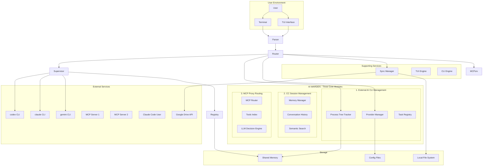
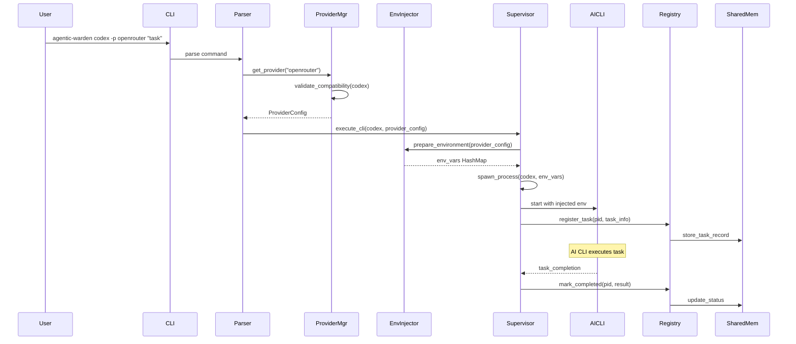
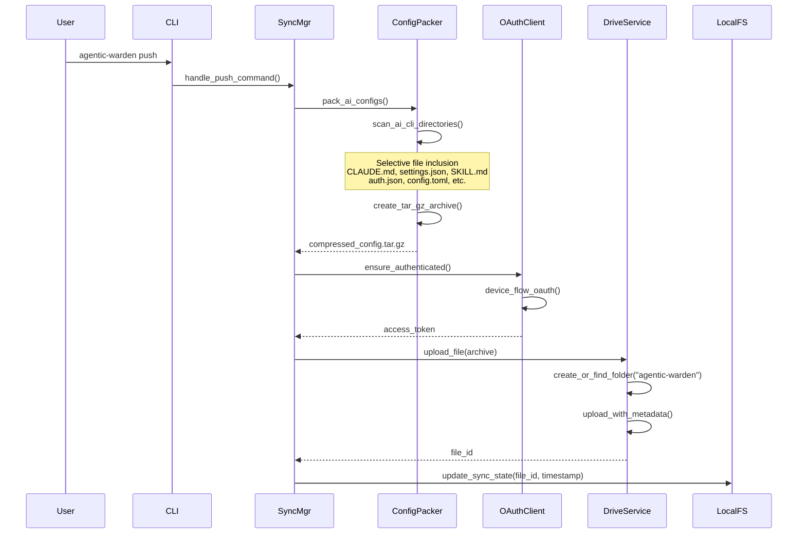
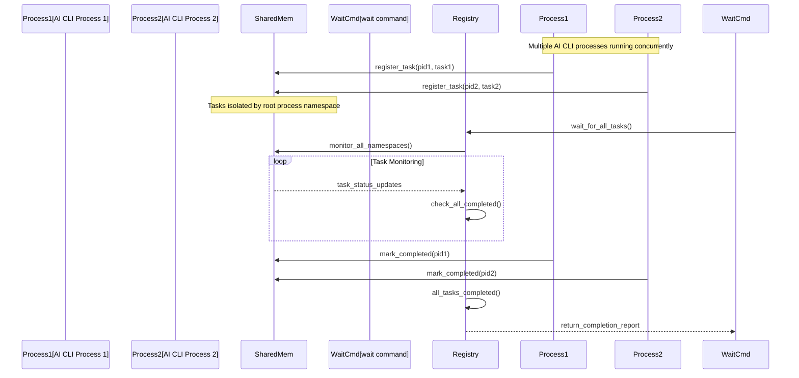
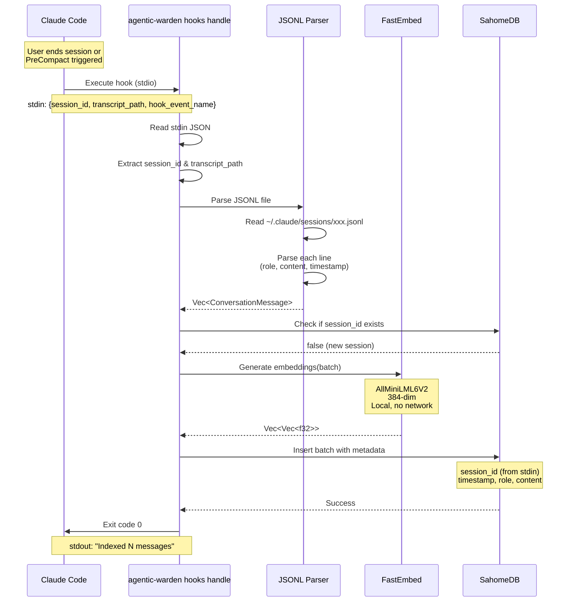
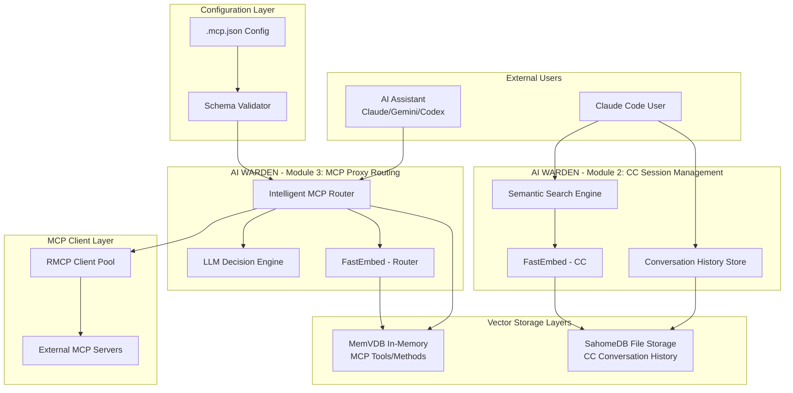
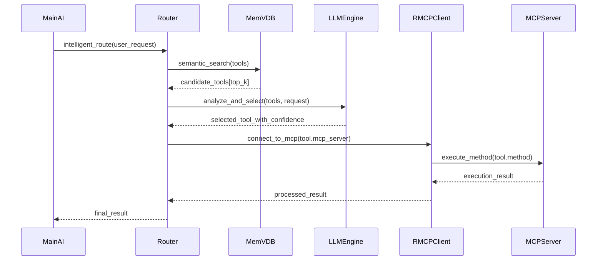

# System Architecture Design - v0.1.0

## Version Information
- Current architecture version: v0.1.0
- Last updated: 2025-11-14
- Based on: Initial development

---

## [v0] Current Architecture Overview

### System Context Diagram


```mermaid
graph TB
    subgraph "User Environment"
        User[User]
        CLI[Terminal]
        TUI[TUI Interface]
    end

    subgraph "AI WARDEN - Three Core Modules"

        subgraph "1. External AI CLI Management"
            ProcTracker[Process Tree Tracker]
            ProviderMgr[Provider Manager]
            TaskRegistry[Task Registry]
        end

        subgraph "2. CC Session Management"
            MemoryMgr[Memory Manager]
            ConvHistory[Conversation History]
            SearchEngine[Semantic Search]
        end

        subgraph "3. MCP Proxy Routing"
            MCPRouter[MCP Router]
            ToolIndex[Tools Index]
            LLMEngine[LLM Decision Engine]
        end
    end

    subgraph "Supporting Services"
        SyncMgr[Sync Manager]
        TUIEngine[TUI Engine]
        CLIEngine[CLI Engine]
    end

    subgraph "External Services"
        AICLI1[codex CLI]
        AICLI2[claude CLI]
        AICLI3[gemini CLI]
        MCPsrv1[MCP Server 1]
        MCPsrv2[MCP Server 2]
        ClaudeCode[Claude Code User]
        GoogleDrive[Google Drive API]
    end

    subgraph "Storage"
        SharedMem[Shared Memory]
        ConfigFiles[Config Files]
        LocalFS[Local File System]
    end

    User --> CLI
    User --> TUI
    CLI --> Parser
    TUI --> Parser
    Parser --> Router
    Router --> Supervisor
    Router --> ProcTracker
    Router --> ProviderMgr
    Router --> SyncMgr
    Router --> MCPsrv

    Supervisor --> AICLI1
    Supervisor --> AICLI2
    Supervisor --> AICLI3

    ProcTracker --> SharedMem
    ProviderMgr --> ConfigFiles
    SyncMgr --> GoogleDrive
    Supervisor --> Registry
    Registry --> SharedMem
    SyncMgr --> LocalFS
```

### Three Core Modules Architecture

#### Module Independence and Relationships

AI WARDEN的三大核心模块在功能上相互独立，各自服务于不同的业务场景：

##### Module 1: External AI CLI Management
**服务对象**: AI CLI用户和开发者
**主要职责**:
- 管理外部AI CLI工具（Claude、Gemini、Codex等）的生命周期
- 提供商配置管理和环境变量注入
- 跨进程任务跟踪和状态监控
- 多AI CLI并发执行协调

**数据流**:
```
用户命令 → CLI解析 → 提供商配置 → AI CLI启动 → 进程监控 → 任务完成
```

##### Module 2: CC Session Management
**服务对象**: Claude Code用户
**主要职责**:
- 存储Claude Code的JSONL格式对话历史
- 基于向量嵌入的语义搜索
- session_id分组的会话管理
- 提供历史对话检索MCP工具

**数据流**:
```
Claude Code会话 → JSONL存储 → 向量化 → 语义索引 → 搜索检索 → 上下文返回
```

##### Module 3: MCP Proxy Routing
**服务对象**: AI助手（Claude/Gemini/Codex）
**主要职责**:
- MCP服务器工具的向量化索引
- 智能工具选择和路由决策
- 两阶段搜索算法（工具级→方法级）
- 统一的MCP接口对外提供服务

**数据流**:
```
AI助手请求 → 语义搜索 → 工具聚类 → LLM决策 → 工具执行 → 结果返回
```

#### Module Integration Points

虽然三大模块功能独立，但通过以下方式进行协作：

1. **进程管理模块**为其他模块提供进程隔离和资源管理
2. **会话管理模块**通过MCP接口向用户提供历史检索服务
3. **路由模块**为AI助手提供智能工具选择能力

### Core Business Flows

#### 1. Provider-Based AI CLI Execution Flow


```mermaid
sequenceDiagram
    participant User
    participant CLI
    participant Parser
    participant ProviderMgr
    participant EnvInjector
    participant Supervisor
    participant AICLI
    participant Registry
    participant SharedMem

    User->>CLI: agentic-warden codex -p openrouter "task"
    CLI->>Parser: parse command
    Parser->>ProviderMgr: get_provider("openrouter")
    ProviderMgr->>ProviderMgr: validate_compatibility(codex)
    ProviderMgr-->>Parser: ProviderConfig

    Parser->>Supervisor: execute_cli(codex, provider_config)
    Supervisor->>EnvInjector: prepare_environment(provider_config)
    EnvInjector-->>Supervisor: env_vars HashMap

    Supervisor->>Supervisor: spawn_process(codex, env_vars)
    Supervisor->>AICLI: start with injected env
    Supervisor->>Registry: register_task(pid, task_info)
    Registry->>SharedMem: store_task_record

    Note over AICLI: AI CLI executes task
    AICLI-->>Supervisor: task_completion
    Supervisor->>Registry: mark_completed(pid, result)
    Registry->>SharedMem: update_status
```

#### 2. Google Drive Configuration Synchronization Flow


```mermaid
sequenceDiagram
    participant User
    participant CLI
    participant SyncMgr
    participant ConfigPacker
    participant OAuthClient
    participant DriveService
    participant LocalFS

    User->>CLI: agentic-warden push
    CLI->>SyncMgr: handle_push_command()

    SyncMgr->>ConfigPacker: pack_ai_configs()
    ConfigPacker->>ConfigPacker: scan_ai_cli_directories()
    Note over ConfigPacker: Selective file inclusion<br/>CLAUDE.md, settings.json, SKILL.md<br/>auth.json, config.toml, etc.
    ConfigPacker->>ConfigPacker: create_tar_gz_archive()
    ConfigPacker-->>SyncMgr: compressed_config.tar.gz

    SyncMgr->>OAuthClient: ensure_authenticated()
    OAuthClient->>OAuthClient: device_flow_oauth()
    OAuthClient-->>SyncMgr: access_token

    SyncMgr->>DriveService: upload_file(archive)
    DriveService->>DriveService: create_or_find_folder("agentic-warden")
    DriveService->>DriveService: upload_with_metadata()
    DriveService-->>SyncMgr: file_id

    SyncMgr->>LocalFS: update_sync_state(file_id, timestamp)
```

#### 3. Cross-Process Task Coordination Flow


```mermaid
sequenceDiagram
    participant Process1[AI CLI Process 1]
    participant Process2[AI CLI Process 2]
    participant SharedMem
    participant WaitCmd[wait command]
    participant Registry

    Note over Process1,Process2: Multiple AI CLI processes running concurrently

    Process1->>SharedMem: register_task(pid1, task1)
    Process2->>SharedMem: register_task(pid2, task2)

    Note over SharedMem: Tasks isolated by root process namespace

    WaitCmd->>Registry: wait_for_all_tasks()
    Registry->>SharedMem: monitor_all_namespaces()

    loop Task Monitoring
        SharedMem-->>Registry: task_status_updates
        Registry->>Registry: check_all_completed()
    end

    Process1->>SharedMem: mark_completed(pid1)
    Process2->>SharedMem: mark_completed(pid2)

    Registry->>Registry: all_tasks_completed()
    Registry-->>WaitCmd: return_completion_report
```

---

## Technology Stack

### [v0] Current Technology Stack
**Version**: v0.1.0+

#### Core Platform
- **Language**: Rust 2021 Edition (1.70+)
- **Async Runtime**: tokio 1.0+ (rt-multi-thread, macros, signal, process)
- **Error Handling**: thiserror 1.0+ + custom error categories

#### User Interface
- **TUI Framework**: ratatui 0.26+ (all-widgets, serde)
- **Terminal Control**: crossterm 0.28+ (event-stream)
- **Graphics**: plotters 0.3 + plotters-bitmap 0.3
- **Color Themes**: color-eyre 0.6

#### Data & Serialization
- **Serialization**: serde 1.0+ (derive) + serde_json 1.0+
- **Configuration**: config 0.14+ (toml, json, yaml) + confy 0.6
- **Binary Formats**: bincode 1.3 + rmp-serde 1.1 (MessagePack)

#### Inter-Process Communication
- **Shared Memory**: shared_memory 0.12 + shared_hashmap 0.1.2
- **Synchronization**: raw_sync 0.1.5 + parking_lot 0.12
- **Process Management**: tokio::process + platform-specific APIs

#### Platform Abstraction
- **Windows**: windows 0.54 (Win32 APIs) + sysinfo 0.32
- **Unix**: psutil 3.2 + nix 0.29 (signal, process) + libc 0.2

#### External Integrations
- **HTTP Client**: reqwest 0.12+ (json, multipart, cookies)
- **Google APIs**: yup-oauth2 8.3 + mime_guess 2.0
- **MCP Protocol**: rmcp 0.5 (server, transport-io, macros)
- **File Operations**: tar 0.4 + flate2 1.0 + walkdir 2.5

#### Development & Testing
- **CLI Parsing**: clap 4.4+ (derive)
- **Testing**: mockall 0.12 + tokio-test 0.4 + wiremock 0.6
- **Logging**: tracing 0.1 + tracing-subscriber 0.3

---

## Architecture Decision Records (ADR)

### ARCH-001: Shared Memory-Based Task Coordination
**Date**: 2025-11-08
**Status**: 🟢 Adopted
**Version**: v0.1.0
**Related Requirements**: REQ-001, REQ-005

#### Background
Agentic-Warden needs to coordinate tasks across multiple AI CLI processes while maintaining isolation and preventing interference. Traditional approaches like process polling or HTTP APIs would introduce latency and complexity.

#### Decision
Use shared memory with namespacing for cross-process task coordination and real-time status tracking.

#### Options Compared
| Approach | Pros | Cons | Performance |
|----------|------|------|-------------|
| **Shared Memory** | <1ms operations, real-time updates, OS-level isolation | Manual cleanup required, platform-specific APIs | **Excellent** (< 1ms) |
| HTTP API | Cross-platform, easy debugging | Network latency, requires service management | Good (10-50ms) |
| File-based IPC | Simple implementation | Slow I/O, file locking complexity | Poor (100+ms) |
| Message Queue | Reliable delivery, scalability | External dependency, complexity | Good (5-20ms) |

#### Rationale
- **Performance Critical**: Task status updates need to be real-time for `wait` command responsiveness
- **Process Isolation**: Shared memory provides OS-level isolation between different AI CLI root processes
- **No External Dependencies**: Self-contained solution doesn't require additional services
- **Cross-Platform**: All target platforms (Windows/Linux/macOS) support shared memory

#### Impact
- **Performance**: Sub-millisecond task status updates and coordination
- **Complexity**: Increased implementation complexity for shared memory management
- **Reliability**: Requires robust cleanup mechanisms to prevent memory leaks
- **Testing**: Complex to test due to concurrency and platform-specific behavior

#### Implementation Details
```rust
// Namespace isolation by AI CLI root process
pub const NAMESPACE_FORMAT: &str = "agentic-warden-{pid}_task";

// Shared memory layout
pub struct TaskRecord {
    pub pid: u32,
    pub root_parent_pid: u32,
    pub prompt: String,
    pub status: TaskStatus,
    pub start_time: DateTime<Utc>,
    pub provider: Option<String>,
}

// Access pattern
pub enum TaskStatus {
    Running,
    CompletedButUnread,
    Completed,
}
```

---

### ARCH-002: Environment Variable Injection for Provider Management
**Date**: 2025-11-08
**Status**: 🟢 Adopted
**Version**: v0.1.0
**Related Requirements**: REQ-002

#### Background
Users need to switch between different API providers (OpenRouter, LiteLLM, official APIs) without modifying AI CLI native configuration files. The solution must be transparent to AI CLI processes and support dynamic switching.

#### Decision
Use environment variable injection at process startup time to dynamically configure AI CLI processes with provider-specific settings.

#### Options Compared
| Approach | Pros | Cons | User Experience |
|----------|------|------|-----------------|
| **Env Variable Injection** | Transparent to AI CLI, no config file modification, dynamic switching | Process-level only, requires restart | **Excellent** (seamless) |
| Config File Patching | Persistent changes, works with restarts | Risk of corrupting native configs, conflicts | Poor (destructive) |
| Proxy Service | Language-agnostic, centralized control | Network dependency, latency | Good (transparent) |
| CLI Wrapper Scripts | Simple implementation | Maintenance overhead, platform differences | Fair (manual) |

#### Rationale
- **Non-Invasive**: Doesn't modify AI CLI native configuration files
- **Dynamic**: Support `-p` parameter for per-execution provider selection
- **Universal**: Works across different AI CLI tools (codex, claude, gemini)
- **Secure**: No need to store sensitive API keys in additional locations

#### Implementation Details
```rust
// Provider configuration structure
pub struct Provider {
    pub name: String,
    pub compatible_with: Vec<AiType>,
    pub env: HashMap<String, String>,  // API keys, base URLs, etc.
}

// Injection process
impl EnvInjector {
    pub fn inject_to_command(cmd: &mut Command, env_vars: &HashMap<String, String>) {
        for (key, value) in env_vars {
            cmd.env(key, value);  // Direct environment variable setting
        }
    }
}
```

#### Impact
- **User Experience**: Seamless provider switching with `-p` flag
- **Security**: API keys remain in provider configuration, not scattered in environment
- **Compatibility**: Works with any CLI tool that respects environment variables
- **Maintenance**: No need to track AI CLI configuration file format changes

---

### ARCH-003: Google Drive Integration with OAuth 2.0 Device Flow
**Date**: 2025-11-08
**Status**: 🟢 Adopted
**Version**: v0.1.0
**Related Requirements**: REQ-003

#### Background
Users need to backup and restore AI CLI configurations across devices. The solution must work in headless environments and support automated workflows without requiring browser interactions.

#### Decision
Use Google Drive API with OAuth 2.0 Device Flow (RFC 8628) for secure, browser-optional authentication and file operations.

#### Options Compared
| Approach | Pros | Cons | Headless Support |
|----------|------|------|------------------|
| **OAuth Device Flow** | Works in headless, standard security, no browser required | Manual copy-paste of codes | **Excellent** |
| OAuth Implicit Flow | Simpler implementation | Requires browser, security concerns | Poor |
| Service Account Keys | Fully automated | Complex setup, key management overhead | Good |
| Local Storage Only | Simple, no external deps | No cross-device sync | Not Applicable |

#### Rationale
- **Headless Compatibility**: Device flow works in SSH sessions, CI/CD, and servers
- **Security**: Standard OAuth 2.0 without storing sensitive credentials
- **User Control**: Users explicitly authorize access to specific folders
- **Automatic**: Once authorized, subsequent operations are fully automated

#### Implementation Details
```rust
// OAuth Device Flow
pub struct OAuthClient {
    pub client_id: String,
    pub auth_scope: String,
}

pub async fn device_flow_auth() -> Result<TokenInfo> {
    // 1. Request device code
    let device_code = get_device_code().await?;

    // 2. Display user instructions
    println!("Please visit: {}", device_code.verification_url);
    println!("Enter code: {}", device_code.user_code);

    // 3. Poll for token completion
    let token = poll_for_token(device_code.device_code).await?;
    Ok(token)
}
```

#### Impact
- **Security**: Industry-standard OAuth with token refresh support
- **Usability**: One-time setup, automatic thereafter
- **Compatibility**: Works across all target platforms
- **Infrastructure**: No additional server requirements

---

### ARCH-004: Selective Configuration Packing Strategy
**Date**: 2025-11-08
**Status**: 🟢 Adopted
**Version**: v0.1.0
**Related Requirements**: REQ-003

#### Background
AI CLI configurations contain a mix of essential settings, temporary files, and user-specific data. Backup must include important configuration while excluding unnecessary files to reduce size and avoid conflicts.

#### Decision
Implement selective file packing that includes only essential configuration files and explicitly excludes temporary, cache, and user-specific content.

#### Options Compared
| Approach | Pros | Cons | Backup Size |
|----------|------|------|-------------|
| **Selective Packing** | Small backup size, no conflicts, targeted | Requires maintenance of file lists | **Optimal** (~1-5MB) |
| Full Directory Backup | Complete, simple implementation | Large size, conflict risk, includes junk | Poor (100MB+) |
| User Configuration Files | Simple, respects user choices | Incomplete backup, missing essential files | Unreliable |

#### Rationale
- **Efficiency**: Reduces backup size by excluding unnecessary files
- **Reliability**: Avoids conflicts from temporary files and caches
- **Portability**: Ensures backups don't contain machine-specific data
- **Maintainability**: Explicit file lists serve as documentation

#### Implementation Details
```rust
// File inclusion strategy
impl ConfigPacker {
    // Claude: CLAUDE.md, settings.json, agents/, skills/SKILL.md
    fn pack_claude_configs(&self) -> Result<Option<(usize, u64)>> {
        let files_to_pack = [
            ("CLAUDE.md", "Main memory file"),
            ("settings.json", "Main configuration"),
        ];
        // Pack agents/ directory and SKILL.md files selectively
    }

    // Codex: auth.json, config.toml, agents.md, history.jsonl
    // Gemini: google_accounts.json, settings.json, gemini.md
}
```

#### Impact
- **Performance**: Faster upload/download due to smaller archives
- **Reliability**: Reduced risk of conflicts from machine-specific files
- **Storage**: Efficient use of Google Drive quota
- **Maintenance**: Clear documentation of essential vs. non-essential files

---

## Module Structure

### [v0] Current Module Architecture

#### Three Core System Modules

AI WARDEN的核心系统由三大功能模块组成，每个模块负责独立的业务领域：

##### 1. External AI CLI Management Module
**Responsibility**: 外部AI CLI工具的启动、监控和管理
**Core Components**:
- Process Tracking (`src/core/process_tree.rs`) - AI CLI进程识别和隔离
- Provider Management (`src/provider/`) - 第三方API提供商配置
- Task Coordination (`src/storage/`, `src/registry/`) - 跨进程任务跟踪

**Key Functions**:
- AI CLI进程启动和生命周期管理
- 提供商配置管理和环境变量注入
- 任务状态监控和进程树跟踪
- 多AI CLI并发执行协调

##### 2. CC (Claude Code) Session Management Module
**Responsibility**: Claude Code用户会话历史的存储和语义搜索
**Core Components**:
- Conversation History Storage (`src/memory/history.rs`) - SahomeDB文件数据库
- Semantic Search (`src/memory/`) - 向量化会话检索
- MCP Tools - `search_history`, `get_session_todos`

**Key Features**:
- JSONL格式会话记录存储
- 基于session_id的会话分组管理
- 语义相似度搜索历史对话
- 工具使用记录和模式分析

##### 3. MCP Proxy Routing Module
**Responsibility**: 为AI助手提供智能MCP工具选择和路由服务
**Core Components**:
- MCP Tools Indexing (`src/mcp_routing/`) - MemVDB内存向量数据库
- Intelligent Routing (`src/mcp_routing/`) - LLM辅助工具选择决策
- RMCP Client Pool (`src/mcp_routing/`) - 动态MCP服务器连接管理

**Key Features**:
- 两阶段搜索：工具级→方法级精确匹配
- 智能聚类算法和相似度阈值配置
- 自动从.mcp.json重建路由索引
- 统一的MCP接口对外提供服务

##### 4. Synchronization (`src/sync/`)
**Responsibility**: Google Drive integration and configuration backup/restore
**Dependencies**: Google Drive API, OAuth client, file system
**Key Components**:
- `GoogleDriveService` - Complete Drive API operations
- `ConfigPacker` - Selective configuration archive creation
- `OAuthClient` - OAuth 2.0 Device Flow implementation

##### 5. User Interface (`src/tui/`)
**Responsibility**: Terminal-based user interface with unified design system
**Dependencies**: ratatui, crossterm
**Key Components**:
- `DashboardScreen` - AI CLI status and task overview
- `ProviderManagementScreen` - Provider configuration interface
- `ProgressScreen` - Sync operation progress display

#### Integration Points

##### 1. Supervisor Integration (`src/supervisor.rs`)
**Central coordination hub that integrates:**
- Process tracking for AI CLI identification
- Provider management for environment injection
- Task registry for lifecycle management
- Signal handling for graceful termination

##### 2. MCP Server (`src/mcp.rs`)
**External integration point providing:**
- Process monitoring tools
- Task status queries
- Provider configuration access
- AI CLI launch capabilities

---

## Security Architecture

### [v0] Security Measures

#### Authentication & Authorization
- **OAuth 2.0**: Standard Google Drive authentication with Device Flow
- **Token Management**: Secure token storage with automatic refresh
- **Scope Limitation**: Minimal Google Drive scopes for configuration backup only

#### Data Protection
- **Configuration Files**: Restricted permissions (600) on provider configurations
- **Shared Memory**: Namespace isolation prevents cross-process data leakage
- **API Keys**: Stored encrypted at rest, never logged

#### Process Isolation
- **Namespace Separation**: Each AI CLI root process has isolated shared memory namespace
- **Privilege Separation**: No unnecessary privileges requested
- **Signal Handling**: Clean process termination without resource leaks

#### Network Security
- **HTTPS Only**: All external communications use TLS
- **Certificate Validation**: Proper certificate chain verification
- **Proxy Support**: Secure proxy configuration for enterprise environments

---

## Performance Architecture

### [v0] Performance Characteristics

#### Benchmarks & Metrics
- **Process Detection**: < 100ms for 100 processes
- **Task Registration**: < 1ms per operation (shared memory)
- **TUI Rendering**: < 16ms per frame (60 FPS)
- **Configuration Sync**: 1-5MB archives, 10-30s typical sync

#### Scalability Considerations
- **Concurrent Tasks**: Supports 50+ concurrent AI CLI processes
- **Memory Usage**: < 50MB baseline + shared memory for task tracking
- **Storage Growth**: Linear with active tasks, automatic cleanup
- **Network Usage**: Minimal, only during configuration sync operations

#### Optimization Strategies
- **Caching**: Process tree detection results cached for 5 seconds
- **Batching**: Shared memory operations batched to reduce syscalls
- **Lazy Loading**: TUI components loaded on-demand
- **Compression**: GZIP compression for configuration archives

---

## Deployment Architecture

### [v0] Deployment Model

#### Installation Methods
- **Cargo Install**: `cargo install agentic-warden` (crates.io)
- **Binary Release**: Pre-compiled binaries for Windows/Linux/macOS
- **Package Managers**: Homebrew, Scoop, AUR community packages

#### Configuration Management
- **User Directory**: `~/.agentic-warden/` for persistent configuration
- **Runtime Directory**: System temp directory for temporary files
- **Shared Memory**: OS-managed shared memory segments
- **No System Dependencies**: Self-contained, no root privileges required

#### Upgrade Strategy
- **Backward Compatibility**: Configuration format versioning with migration
- **Graceful Migration**: Automatic backup during major version upgrades
- **Rollback Support**: Configuration archives for rollback scenarios

---

### ARCH-010: Claude Code会话历史Hook集成架构
**Date**: 2025-11-14
**Status**: 🟢 Done
**Version**: v0.2.0
**Related Requirements**: REQ-010

#### Background
Claude Code provides hooks mechanism for session lifecycle events. We need to capture conversation history automatically without manual CLI commands, enabling seamless semantic search via MCP tools.

#### Decision
Use Claude Code's `SessionEnd` and `PreCompact` hooks to trigger automatic conversation history ingestion into vector database.

#### Options Compared
| Approach | Pros | Cons | User Experience |
|----------|------|------|-----------------|
| **Hook-based (Selected)** | Automatic, zero user effort, real-time | Requires Claude Code setup | **Excellent** (invisible) |
| Manual CLI import | Simple, no dependencies | User must remember to run | Poor (friction) |
| File watcher | Automatic detection | Complex, resource-heavy | Good (automatic) |
| Periodic cron job | Scheduled, reliable | Delayed ingestion, overhead | Fair (not real-time) |

#### Rationale
- **Zero Friction**: Users configure hooks once, then forget about it
- **Real-Time**: Conversations indexed immediately after session ends
- **Native Integration**: Leverages Claude Code's official hook mechanism
- **Session Context**: Hook provides session_id directly from stdin
- **Idempotent**: Can re-run on same session without duplicates

#### Architecture Diagram


```mermaid
sequenceDiagram
    participant CC as Claude Code
    participant Hook as agentic-warden hooks handle
    participant Parser as JSONL Parser
    participant Embed as FastEmbed
    participant DB as SahomeDB

    Note over CC: User ends session or<br/>PreCompact triggered

    CC->>Hook: Execute hook (stdio)
    Note over CC,Hook: stdin: {session_id, transcript_path, hook_event_name}

    Hook->>Hook: Read stdin JSON
    Hook->>Hook: Extract session_id & transcript_path

    Hook->>Parser: Parse JSONL file
    Parser->>Parser: Read ~/.claude/sessions/xxx.jsonl
    Parser->>Parser: Parse each line<br/>(role, content, timestamp)
    Parser-->>Hook: Vec<ConversationMessage>

    Hook->>DB: Check if session_id exists
    DB-->>Hook: false (new session)

    Hook->>Embed: Generate embeddings(batch)
    Note over Embed: AllMiniLML6V2<br/>384-dim<br/>Local, no network
    Embed-->>Hook: Vec<Vec<f32>>

    Hook->>DB: Insert batch with metadata
    Note over DB: session_id (from stdin)<br/>timestamp, role, content

    DB-->>Hook: Success

    Hook->>CC: Exit code 0
    Note over Hook,CC: stdout: "Indexed N messages"
```

#### Component Design

```rust
// Hook input from Claude Code (stdin)
#[derive(Deserialize)]
struct ClaudeCodeHookInput {
    session_id: String,           // From hook stdin
    transcript_path: String,      // JSONL file path
    hook_event_name: String,      // "SessionEnd" | "PreCompact"
    cwd: Option<String>,
    permission_mode: Option<String>,
}

// JSONL parser for Claude Code format
pub struct ClaudeCodeTranscriptParser;

impl ClaudeCodeTranscriptParser {
    pub fn parse_file(path: &Path) -> Result<Vec<ConversationMessage>> {
        // Stream parse JSONL
        // Extract role, content, timestamp from each line
    }
}

// Hook handler orchestrator
pub struct HookHandler {
    parser: ClaudeCodeTranscriptParser,
    embedder: FastEmbedGenerator,
    store: ConversationHistoryStore,
}

impl HookHandler {
    pub async fn handle_from_stdin() -> Result<()> {
        // 1. Read stdin JSON
        let input: ClaudeCodeHookInput = serde_json::from_reader(std::io::stdin())?;

        // 2. Check if already processed
        if self.store.has_session(&input.session_id).await? {
            eprintln!("Session {} already indexed, skipping", input.session_id);
            return Ok(());
        }

        // 3. Parse JSONL transcript
        let messages = self.parser.parse_file(&input.transcript_path)?;

        // 4. Generate embeddings (batch of 10)
        let embeddings = self.embedder.generate_batch(
            messages.iter().map(|m| &m.content).collect()
        ).await?;

        // 5. Store with session_id from stdin
        for (msg, embedding) in messages.iter().zip(embeddings) {
            let record = ConversationRecord {
                id: Uuid::new_v4().to_string(),
                session_id: Some(input.session_id.clone()),  // From stdin!
                role: msg.role.clone(),
                content: msg.content.clone(),
                timestamp: msg.timestamp,
                tools_used: vec![],
            };
            self.store.append(record, embedding).await?;
        }

        println!("✅ Indexed {} messages for session {}", messages.len(), input.session_id);
        Ok(())
    }
}
```

#### Data Flow

| Stage | Component | Input | Output | Performance |
|-------|-----------|-------|--------|-------------|
| **Hook Trigger** | Claude Code | Session ends | Executes hook command | Instant |
| **Stdin Read** | Hook CLI | JSON from stdin | ClaudeCodeHookInput | < 1ms |
| **JSONL Parse** | Parser | transcript_path file | Vec<ConversationMessage> | 10ms per 1000 lines |
| **Dedup Check** | SahomeDB | session_id | boolean (exists?) | < 20ms |
| **Embedding** | FastEmbed | Batch of messages | Vec<Vec<f32>> (384-dim) | 10ms per 10 messages |
| **Vector Insert** | SahomeDB | Records + embeddings | Success | 5ms per 10 records |
| **Hook Exit** | Hook CLI | - | Exit code 0 | Instant |

**Total Time**: < 2s for typical session (100 messages)

#### Impact
- **User Experience**: Completely transparent, zero manual intervention
- **Data Freshness**: Conversations available for search immediately after session
- **Resource Usage**: Minimal (FastEmbed local, no network calls)
- **Reliability**: Idempotent design prevents duplicate entries
- **Integration**: Native Claude Code hooks, no polling or file watchers

---

## [v0] Intelligent MCP Routing Architecture

### ARCH-012: 智能MCP路由系统架构设计

#### System Context Integration


```mermaid
graph TB
    subgraph "External Users"
        MainAI[AI Assistant<br/>Claude/Gemini/Codex]
        ClaudeUser[Claude Code User]
    end

    subgraph "AI WARDEN - Module 3: MCP Proxy Routing"
        IntelligentRouter[Intelligent MCP Router]
        LLMEngine[LLM Decision Engine]
        FastEmbedRouter[FastEmbed - Router]
    end

    subgraph "AI WARDEN - Module 2: CC Session Management"
        ConvHistory[Conversation History Store]
        SearchEngine[Semantic Search Engine]
        FastEmbedCC[FastEmbed - CC]
    end

    subgraph "Vector Storage Layers"
        MemVDB[MemVDB In-Memory<br/>MCP Tools/Methods]
        SahomeDB[SahomeDB File Storage<br/>CC Conversation History]
    end

    subgraph "MCP Client Layer"
        RMCPClientPool[RMCP Client Pool]
        MCPServers[External MCP Servers]
    end

    subgraph "Configuration Layer"
        MCPConfig[.mcp.json Config]
        ConfigValidator[Schema Validator]
    end

    %% MCP Routing Flow
    MainAI --> IntelligentRouter
    IntelligentRouter --> MemVDB
    IntelligentRouter --> LLMEngine
    IntelligentRouter --> FastEmbedRouter
    IntelligentRouter --> RMCPClientPool
    RMCPClientPool --> MCPServers
    FastEmbedRouter --> MemVDB

    %% CC Session Management Flow (Independent)
    ClaudeUser --> ConvHistory
    ClaudeUser --> SearchEngine
    ConvHistory --> SahomeDB
    SearchEngine --> FastEmbedCC
    FastEmbedCC --> SahomeDB

    %% Configuration
    MCPConfig --> ConfigValidator
    ConfigValidator --> IntelligentRouter
```

#### Module Independence

**重要说明**: CC会话管理模块与MCP路由模块在功能上完全独立：

- **CC会话管理**: 服务于Claude Code用户，存储和检索历史对话
- **MCP路由模块**: 服务于AI助手，智能选择和调用MCP工具
- **无直接依赖**: 两个模块使用独立的向量存储和嵌入服务
- **独立数据流**: 各自有不同的服务对象和数据用途

#### Component Architecture Details

##### 1. Intelligent MCP Router (Core Component)
- **Purpose**: Meta-MCP gateway providing intelligent tool discovery and routing
- **Interface**: Two public methods - `intelligent_route`, `get_method_schema`
- **Internal Components**: Vector search engine, clustering algorithm, request dispatcher

##### 2. Dual-Mode Vector Database Layer
- **MemVDB (In-Memory)**:
  - Collections: `mcp_tools`, `mcp_methods`
  - Purpose: Fast MCP routing index, rebuilt on startup from .mcp.json
  - Features: Thread-safe, cosine similarity, batch operations
  - Lifecycle: Memory-only, destroyed on shutdown
  - Rebuild: Automatically reconstructed from MCP configuration

- **SahomeDB (File-based Persistent)**:
  - Collections: `conversation_history`
  - Purpose: Claude Code conversation history storage and semantic search
  - Features: Persistent file storage, zero external dependencies, semantic search
  - Integration: New conversation history management module
  - Data: Session metadata, conversation context, tool usage patterns

##### 3. RMCP Client Connection Pool
- **Purpose**: Dynamic MCP server lifecycle management
- **Features**: Health monitoring, auto-reconnection, concurrent operations
- **Isolation**: Proper process isolation and resource management
- **Discovery**: Automatic tool schema discovery and caching

##### 4. LLM Decision Engine
- **Purpose**: Intelligent tool/method selection using semantic understanding
- **Integration**: Ollama service with configurable endpoints
- **Models**: qwen2.5:7b (default), configurable via environment
- **Capabilities**: Clustering analysis, ambiguity handling, confidence scoring

#### Data Flow Architecture


```mermaid
sequenceDiagram
    participant MainAI
    participant Router
    participant MemVDB
    participant LLMEngine
    participant RMCPClient
    participant MCPServer

    MainAI->>Router: intelligent_route(user_request)
    Router->>MemVDB: semantic_search(tools)
    MemVDB-->>Router: candidate_tools[top_k]
    Router->>LLMEngine: analyze_and_select(tools, request)
    LLMEngine-->>Router: selected_tool_with_confidence
    Router->>RMCPClient: connect_to_mcp(tool.mcp_server)
    RMCPClient->>MCPServer: execute_method(tool.method)
    MCPServer-->>RMCPClient: execution_result
    RMCPClient-->>Router: processed_result
    Router-->>MainAI: final_result
```

#### Technology Stack Integration

##### New Dependencies for ARCH-012:
- `fastembed` = "4.0.0" # Local text embedding generation
- `memvdb` = "0.1.1" # In-memory vector database for MCP routing (pure Rust, zero deps)
- `sahomedb` = "0.4.0" # File-based vector database for conversation history
- `rmcp` = { version = "0.5", features = ["client", "server", "transport-io", "transport-child-process", "macros"] } # MCP client functionality
- `ollama-rs` = "0.3.1" # LLM communication (retained for tool selection decisions)
- `ndarray` = { version = "0.15", features = ["serde"] } # Vector calculations (FastEmbed dependency)

##### Existing Component Integration:
- **Memory Module**: Refactored to use FastEmbed embeddings + SahomeDB for conversation history
- **Configuration System**: Extends .mcp.json validation and management
- **Process Supervisor**: Integrates with MCP server lifecycle management
- **Embedding Service**: Replaced Ollama-based embedding with FastEmbed local generation

#### Performance Architecture

##### Key Performance Targets:
- **Tool Discovery**: < 50ms for typical semantic queries (MemVDB + FastEmbed)
- **Method Routing**: < 200ms end-to-end including LLM decisions
- **Embedding Generation**: < 30ms local (FastEmbed vs 200-500ms network)
- **Vector Search**: < 10ms for MemVDB operations, < 150ms for SahomeDB
- **Conversation History Search**: < 200ms for semantic queries
- **MCP Connections**: Support 10+ concurrent client connections
- **Memory Usage**: < 50MB for MemVDB index, < 200MB for SahomeDB storage
- **Startup Time**: < 500ms for MemVDB index reconstruction from .mcp.json

##### Scalability Considerations:
- **Horizontal Scaling**: Multiple MCP server connections
- **Memory Management**: Efficient MemVDB data structures, automatic cleanup
- **Caching Strategy**: Route result caching with TTL-based invalidation
- **Load Balancing**: Connection pool distribution and health-based routing

---

## Deprecated Architecture Solutions

### Historical Decisions (Not applicable for v0)

*Note: This is the initial architecture version. Future deprecated solutions will be documented here when architectural changes are made.*