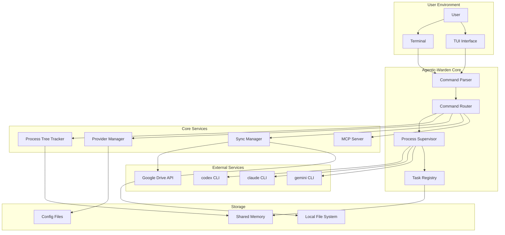
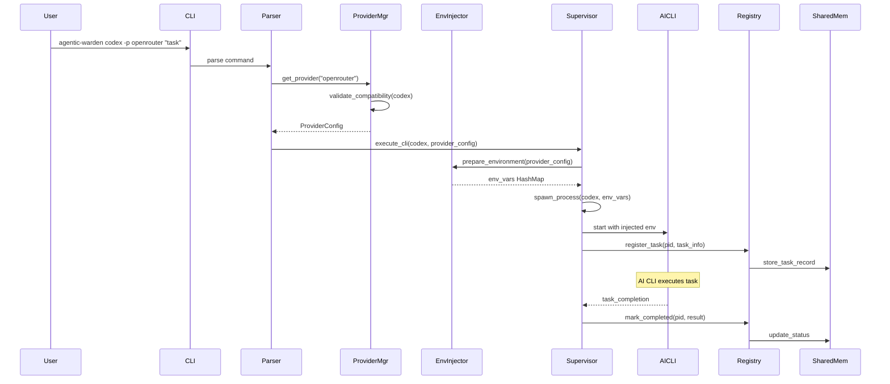
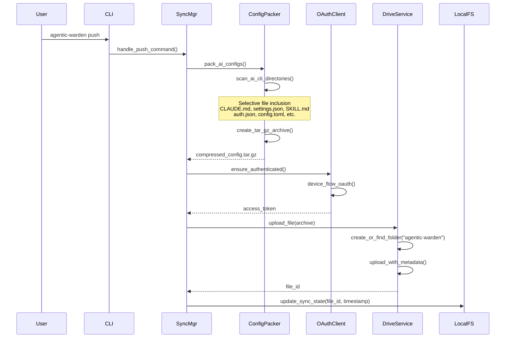
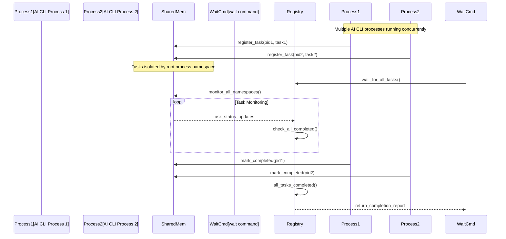
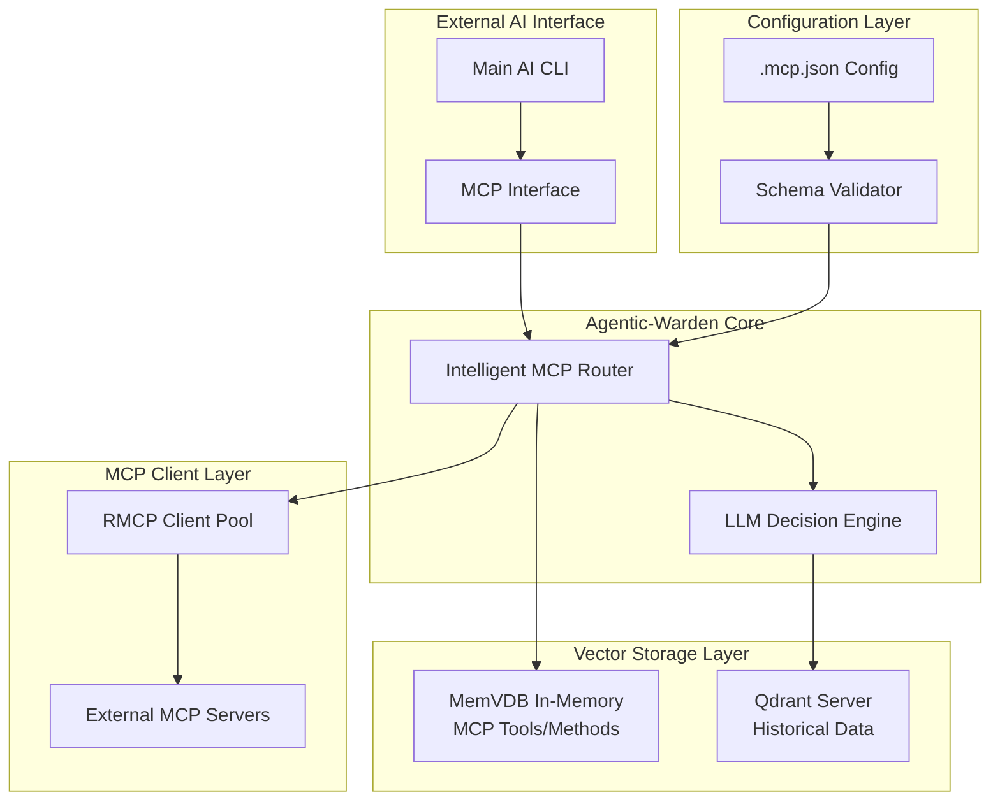
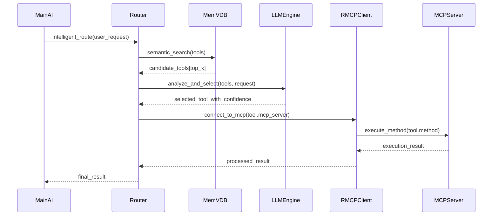

# System Architecture Design - v0.x.x

## Version Information
- Current architecture version: v0
- Last updated: 2025-11-12
- Based on: Initial development (v0.1.0)

---

## [v0] Current Architecture Overview

### System Context Diagram


```mermaid
graph TB
    subgraph "User Environment"
        User[User]
        CLI[Terminal]
        TUI[TUI Interface]
    end

    subgraph "Agentic-Warden Core"
        Parser[Command Parser]
        Router[Command Router]
        Supervisor[Process Supervisor]
        Registry[Task Registry]
    end

    subgraph "Core Services"
        ProcTracker[Process Tree Tracker]
        ProviderMgr[Provider Manager]
        SyncMgr[Sync Manager]
        MCPsrv[MCP Server]
    end

    subgraph "External Services"
        AICLI1[codex CLI]
        AICLI2[claude CLI]
        AICLI3[gemini CLI]
        GoogleDrive[Google Drive API]
    end

    subgraph "Storage"
        SharedMem[Shared Memory]
        ConfigFiles[Config Files]
        LocalFS[Local File System]
    end

    User --> CLI
    User --> TUI
    CLI --> Parser
    TUI --> Parser
    Parser --> Router
    Router --> Supervisor
    Router --> ProcTracker
    Router --> ProviderMgr
    Router --> SyncMgr
    Router --> MCPsrv

    Supervisor --> AICLI1
    Supervisor --> AICLI2
    Supervisor --> AICLI3

    ProcTracker --> SharedMem
    ProviderMgr --> ConfigFiles
    SyncMgr --> GoogleDrive
    Supervisor --> Registry
    Registry --> SharedMem
    SyncMgr --> LocalFS
```

### Core Business Flows

#### 1. Provider-Based AI CLI Execution Flow


```mermaid
sequenceDiagram
    participant User
    participant CLI
    participant Parser
    participant ProviderMgr
    participant EnvInjector
    participant Supervisor
    participant AICLI
    participant Registry
    participant SharedMem

    User->>CLI: agentic-warden codex -p openrouter "task"
    CLI->>Parser: parse command
    Parser->>ProviderMgr: get_provider("openrouter")
    ProviderMgr->>ProviderMgr: validate_compatibility(codex)
    ProviderMgr-->>Parser: ProviderConfig

    Parser->>Supervisor: execute_cli(codex, provider_config)
    Supervisor->>EnvInjector: prepare_environment(provider_config)
    EnvInjector-->>Supervisor: env_vars HashMap

    Supervisor->>Supervisor: spawn_process(codex, env_vars)
    Supervisor->>AICLI: start with injected env
    Supervisor->>Registry: register_task(pid, task_info)
    Registry->>SharedMem: store_task_record

    Note over AICLI: AI CLI executes task
    AICLI-->>Supervisor: task_completion
    Supervisor->>Registry: mark_completed(pid, result)
    Registry->>SharedMem: update_status
```

#### 2. Google Drive Configuration Synchronization Flow


```mermaid
sequenceDiagram
    participant User
    participant CLI
    participant SyncMgr
    participant ConfigPacker
    participant OAuthClient
    participant DriveService
    participant LocalFS

    User->>CLI: agentic-warden push
    CLI->>SyncMgr: handle_push_command()

    SyncMgr->>ConfigPacker: pack_ai_configs()
    ConfigPacker->>ConfigPacker: scan_ai_cli_directories()
    Note over ConfigPacker: Selective file inclusion<br/>CLAUDE.md, settings.json, SKILL.md<br/>auth.json, config.toml, etc.
    ConfigPacker->>ConfigPacker: create_tar_gz_archive()
    ConfigPacker-->>SyncMgr: compressed_config.tar.gz

    SyncMgr->>OAuthClient: ensure_authenticated()
    OAuthClient->>OAuthClient: device_flow_oauth()
    OAuthClient-->>SyncMgr: access_token

    SyncMgr->>DriveService: upload_file(archive)
    DriveService->>DriveService: create_or_find_folder("agentic-warden")
    DriveService->>DriveService: upload_with_metadata()
    DriveService-->>SyncMgr: file_id

    SyncMgr->>LocalFS: update_sync_state(file_id, timestamp)
```

#### 3. Cross-Process Task Coordination Flow


```mermaid
sequenceDiagram
    participant Process1[AI CLI Process 1]
    participant Process2[AI CLI Process 2]
    participant SharedMem
    participant WaitCmd[wait command]
    participant Registry

    Note over Process1,Process2: Multiple AI CLI processes running concurrently

    Process1->>SharedMem: register_task(pid1, task1)
    Process2->>SharedMem: register_task(pid2, task2)

    Note over SharedMem: Tasks isolated by root process namespace

    WaitCmd->>Registry: wait_for_all_tasks()
    Registry->>SharedMem: monitor_all_namespaces()

    loop Task Monitoring
        SharedMem-->>Registry: task_status_updates
        Registry->>Registry: check_all_completed()
    end

    Process1->>SharedMem: mark_completed(pid1)
    Process2->>SharedMem: mark_completed(pid2)

    Registry->>Registry: all_tasks_completed()
    Registry-->>WaitCmd: return_completion_report
```

---

## Technology Stack

### [v0] Current Technology Stack
**Version**: v0.1.0+

#### Core Platform
- **Language**: Rust 2021 Edition (1.70+)
- **Async Runtime**: tokio 1.0+ (rt-multi-thread, macros, signal, process)
- **Error Handling**: thiserror 1.0+ + custom error categories

#### User Interface
- **TUI Framework**: ratatui 0.26+ (all-widgets, serde)
- **Terminal Control**: crossterm 0.28+ (event-stream)
- **Graphics**: plotters 0.3 + plotters-bitmap 0.3
- **Color Themes**: color-eyre 0.6

#### Data & Serialization
- **Serialization**: serde 1.0+ (derive) + serde_json 1.0+
- **Configuration**: config 0.14+ (toml, json, yaml) + confy 0.6
- **Binary Formats**: bincode 1.3 + rmp-serde 1.1 (MessagePack)

#### Inter-Process Communication
- **Shared Memory**: shared_memory 0.12 + shared_hashmap 0.1.2
- **Synchronization**: raw_sync 0.1.5 + parking_lot 0.12
- **Process Management**: tokio::process + platform-specific APIs

#### Platform Abstraction
- **Windows**: windows 0.54 (Win32 APIs) + sysinfo 0.32
- **Unix**: psutil 3.2 + nix 0.29 (signal, process) + libc 0.2

#### External Integrations
- **HTTP Client**: reqwest 0.12+ (json, multipart, cookies)
- **Google APIs**: yup-oauth2 8.3 + mime_guess 2.0
- **MCP Protocol**: rmcp 0.5 (server, transport-io, macros)
- **File Operations**: tar 0.4 + flate2 1.0 + walkdir 2.5

#### Development & Testing
- **CLI Parsing**: clap 4.4+ (derive)
- **Testing**: mockall 0.12 + tokio-test 0.4 + wiremock 0.6
- **Logging**: tracing 0.1 + tracing-subscriber 0.3

---

## Architecture Decision Records (ADR)

### ARCH-001: Shared Memory-Based Task Coordination
**Date**: 2025-11-08
**Status**: 🟢 Adopted
**Version**: v0.1.0
**Related Requirements**: REQ-001, REQ-005

#### Background
Agentic-Warden needs to coordinate tasks across multiple AI CLI processes while maintaining isolation and preventing interference. Traditional approaches like process polling or HTTP APIs would introduce latency and complexity.

#### Decision
Use shared memory with namespacing for cross-process task coordination and real-time status tracking.

#### Options Compared
| Approach | Pros | Cons | Performance |
|----------|------|------|-------------|
| **Shared Memory** | <1ms operations, real-time updates, OS-level isolation | Manual cleanup required, platform-specific APIs | **Excellent** (< 1ms) |
| HTTP API | Cross-platform, easy debugging | Network latency, requires service management | Good (10-50ms) |
| File-based IPC | Simple implementation | Slow I/O, file locking complexity | Poor (100+ms) |
| Message Queue | Reliable delivery, scalability | External dependency, complexity | Good (5-20ms) |

#### Rationale
- **Performance Critical**: Task status updates need to be real-time for `wait` command responsiveness
- **Process Isolation**: Shared memory provides OS-level isolation between different AI CLI root processes
- **No External Dependencies**: Self-contained solution doesn't require additional services
- **Cross-Platform**: All target platforms (Windows/Linux/macOS) support shared memory

#### Impact
- **Performance**: Sub-millisecond task status updates and coordination
- **Complexity**: Increased implementation complexity for shared memory management
- **Reliability**: Requires robust cleanup mechanisms to prevent memory leaks
- **Testing**: Complex to test due to concurrency and platform-specific behavior

#### Implementation Details
```rust
// Namespace isolation by AI CLI root process
pub const NAMESPACE_FORMAT: &str = "agentic-warden-{pid}_task";

// Shared memory layout
pub struct TaskRecord {
    pub pid: u32,
    pub root_parent_pid: u32,
    pub prompt: String,
    pub status: TaskStatus,
    pub start_time: DateTime<Utc>,
    pub provider: Option<String>,
}

// Access pattern
pub enum TaskStatus {
    Running,
    CompletedButUnread,
    Completed,
}
```

---

### ARCH-002: Environment Variable Injection for Provider Management
**Date**: 2025-11-08
**Status**: 🟢 Adopted
**Version**: v0.1.0
**Related Requirements**: REQ-002

#### Background
Users need to switch between different API providers (OpenRouter, LiteLLM, official APIs) without modifying AI CLI native configuration files. The solution must be transparent to AI CLI processes and support dynamic switching.

#### Decision
Use environment variable injection at process startup time to dynamically configure AI CLI processes with provider-specific settings.

#### Options Compared
| Approach | Pros | Cons | User Experience |
|----------|------|------|-----------------|
| **Env Variable Injection** | Transparent to AI CLI, no config file modification, dynamic switching | Process-level only, requires restart | **Excellent** (seamless) |
| Config File Patching | Persistent changes, works with restarts | Risk of corrupting native configs, conflicts | Poor (destructive) |
| Proxy Service | Language-agnostic, centralized control | Network dependency, latency | Good (transparent) |
| CLI Wrapper Scripts | Simple implementation | Maintenance overhead, platform differences | Fair (manual) |

#### Rationale
- **Non-Invasive**: Doesn't modify AI CLI native configuration files
- **Dynamic**: Support `-p` parameter for per-execution provider selection
- **Universal**: Works across different AI CLI tools (codex, claude, gemini)
- **Secure**: No need to store sensitive API keys in additional locations

#### Implementation Details
```rust
// Provider configuration structure
pub struct Provider {
    pub name: String,
    pub compatible_with: Vec<AiType>,
    pub env: HashMap<String, String>,  // API keys, base URLs, etc.
}

// Injection process
impl EnvInjector {
    pub fn inject_to_command(cmd: &mut Command, env_vars: &HashMap<String, String>) {
        for (key, value) in env_vars {
            cmd.env(key, value);  // Direct environment variable setting
        }
    }
}
```

#### Impact
- **User Experience**: Seamless provider switching with `-p` flag
- **Security**: API keys remain in provider configuration, not scattered in environment
- **Compatibility**: Works with any CLI tool that respects environment variables
- **Maintenance**: No need to track AI CLI configuration file format changes

---

### ARCH-003: Google Drive Integration with OAuth 2.0 Device Flow
**Date**: 2025-11-08
**Status**: 🟢 Adopted
**Version**: v0.1.0
**Related Requirements**: REQ-003

#### Background
Users need to backup and restore AI CLI configurations across devices. The solution must work in headless environments and support automated workflows without requiring browser interactions.

#### Decision
Use Google Drive API with OAuth 2.0 Device Flow (RFC 8628) for secure, browser-optional authentication and file operations.

#### Options Compared
| Approach | Pros | Cons | Headless Support |
|----------|------|------|------------------|
| **OAuth Device Flow** | Works in headless, standard security, no browser required | Manual copy-paste of codes | **Excellent** |
| OAuth Implicit Flow | Simpler implementation | Requires browser, security concerns | Poor |
| Service Account Keys | Fully automated | Complex setup, key management overhead | Good |
| Local Storage Only | Simple, no external deps | No cross-device sync | Not Applicable |

#### Rationale
- **Headless Compatibility**: Device flow works in SSH sessions, CI/CD, and servers
- **Security**: Standard OAuth 2.0 without storing sensitive credentials
- **User Control**: Users explicitly authorize access to specific folders
- **Automatic**: Once authorized, subsequent operations are fully automated

#### Implementation Details
```rust
// OAuth Device Flow
pub struct OAuthClient {
    pub client_id: String,
    pub auth_scope: String,
}

pub async fn device_flow_auth() -> Result<TokenInfo> {
    // 1. Request device code
    let device_code = get_device_code().await?;

    // 2. Display user instructions
    println!("Please visit: {}", device_code.verification_url);
    println!("Enter code: {}", device_code.user_code);

    // 3. Poll for token completion
    let token = poll_for_token(device_code.device_code).await?;
    Ok(token)
}
```

#### Impact
- **Security**: Industry-standard OAuth with token refresh support
- **Usability**: One-time setup, automatic thereafter
- **Compatibility**: Works across all target platforms
- **Infrastructure**: No additional server requirements

---

### ARCH-004: Selective Configuration Packing Strategy
**Date**: 2025-11-08
**Status**: 🟢 Adopted
**Version**: v0.1.0
**Related Requirements**: REQ-003

#### Background
AI CLI configurations contain a mix of essential settings, temporary files, and user-specific data. Backup must include important configuration while excluding unnecessary files to reduce size and avoid conflicts.

#### Decision
Implement selective file packing that includes only essential configuration files and explicitly excludes temporary, cache, and user-specific content.

#### Options Compared
| Approach | Pros | Cons | Backup Size |
|----------|------|------|-------------|
| **Selective Packing** | Small backup size, no conflicts, targeted | Requires maintenance of file lists | **Optimal** (~1-5MB) |
| Full Directory Backup | Complete, simple implementation | Large size, conflict risk, includes junk | Poor (100MB+) |
| User Configuration Files | Simple, respects user choices | Incomplete backup, missing essential files | Unreliable |

#### Rationale
- **Efficiency**: Reduces backup size by excluding unnecessary files
- **Reliability**: Avoids conflicts from temporary files and caches
- **Portability**: Ensures backups don't contain machine-specific data
- **Maintainability**: Explicit file lists serve as documentation

#### Implementation Details
```rust
// File inclusion strategy
impl ConfigPacker {
    // Claude: CLAUDE.md, settings.json, agents/, skills/SKILL.md
    fn pack_claude_configs(&self) -> Result<Option<(usize, u64)>> {
        let files_to_pack = [
            ("CLAUDE.md", "Main memory file"),
            ("settings.json", "Main configuration"),
        ];
        // Pack agents/ directory and SKILL.md files selectively
    }

    // Codex: auth.json, config.toml, agents.md, history.jsonl
    // Gemini: google_accounts.json, settings.json, gemini.md
}
```

#### Impact
- **Performance**: Faster upload/download due to smaller archives
- **Reliability**: Reduced risk of conflicts from machine-specific files
- **Storage**: Efficient use of Google Drive quota
- **Maintenance**: Clear documentation of essential vs. non-essential files

---

## Module Structure

### [v0] Current Module Architecture

#### Core Modules

##### 1. Process Tracking (`src/core/process_tree.rs`)
**Responsibility**: Identify AI CLI root processes and provide process isolation
**Dependencies**: Platform-specific process APIs (winapi/procfs)
**Key Functions**:
- `get_process_tree_info(pid)` - Build process chain with AI CLI detection
- `detect_npm_ai_cli_type(pid)` - Identify NPM-based AI CLI tools
- `find_ai_cli_root(process_chain)` - Locate AI CLI root process

##### 2. Provider Management (`src/provider/`)
**Responsibility**: Manage third-party API provider configurations and injection
**Dependencies**: Configuration files, environment variable APIs
**Key Components**:
- `ProviderManager` - Central provider registry and validation
- `EnvInjector` - Environment variable injection for AI CLI processes
- `NetworkDetector` - Network availability and proxy detection

##### 3. Task Coordination (`src/storage/`, `src/registry/`)
**Responsibility**: Cross-process task tracking and status management
**Dependencies**: Shared memory, atomic operations
**Key Components**:
- `SharedMemoryStorage` - High-performance cross-process storage
- `TaskRegistry` - Task lifecycle management
- `UnifiedRegistry` - Unified interface for different storage backends

##### 4. Synchronization (`src/sync/`)
**Responsibility**: Google Drive integration and configuration backup/restore
**Dependencies**: Google Drive API, OAuth client, file system
**Key Components**:
- `GoogleDriveService` - Complete Drive API operations
- `ConfigPacker` - Selective configuration archive creation
- `OAuthClient` - OAuth 2.0 Device Flow implementation

##### 5. User Interface (`src/tui/`)
**Responsibility**: Terminal-based user interface with unified design system
**Dependencies**: ratatui, crossterm
**Key Components**:
- `DashboardScreen` - AI CLI status and task overview
- `ProviderManagementScreen` - Provider configuration interface
- `ProgressScreen` - Sync operation progress display

#### Integration Points

##### 1. Supervisor Integration (`src/supervisor.rs`)
**Central coordination hub that integrates:**
- Process tracking for AI CLI identification
- Provider management for environment injection
- Task registry for lifecycle management
- Signal handling for graceful termination

##### 2. MCP Server (`src/mcp.rs`)
**External integration point providing:**
- Process monitoring tools
- Task status queries
- Provider configuration access
- AI CLI launch capabilities

---

## Security Architecture

### [v0] Security Measures

#### Authentication & Authorization
- **OAuth 2.0**: Standard Google Drive authentication with Device Flow
- **Token Management**: Secure token storage with automatic refresh
- **Scope Limitation**: Minimal Google Drive scopes for configuration backup only

#### Data Protection
- **Configuration Files**: Restricted permissions (600) on provider configurations
- **Shared Memory**: Namespace isolation prevents cross-process data leakage
- **API Keys**: Stored encrypted at rest, never logged

#### Process Isolation
- **Namespace Separation**: Each AI CLI root process has isolated shared memory namespace
- **Privilege Separation**: No unnecessary privileges requested
- **Signal Handling**: Clean process termination without resource leaks

#### Network Security
- **HTTPS Only**: All external communications use TLS
- **Certificate Validation**: Proper certificate chain verification
- **Proxy Support**: Secure proxy configuration for enterprise environments

---

## Performance Architecture

### [v0] Performance Characteristics

#### Benchmarks & Metrics
- **Process Detection**: < 100ms for 100 processes
- **Task Registration**: < 1ms per operation (shared memory)
- **TUI Rendering**: < 16ms per frame (60 FPS)
- **Configuration Sync**: 1-5MB archives, 10-30s typical sync

#### Scalability Considerations
- **Concurrent Tasks**: Supports 50+ concurrent AI CLI processes
- **Memory Usage**: < 50MB baseline + shared memory for task tracking
- **Storage Growth**: Linear with active tasks, automatic cleanup
- **Network Usage**: Minimal, only during configuration sync operations

#### Optimization Strategies
- **Caching**: Process tree detection results cached for 5 seconds
- **Batching**: Shared memory operations batched to reduce syscalls
- **Lazy Loading**: TUI components loaded on-demand
- **Compression**: GZIP compression for configuration archives

---

## Deployment Architecture

### [v0] Deployment Model

#### Installation Methods
- **Cargo Install**: `cargo install agentic-warden` (crates.io)
- **Binary Release**: Pre-compiled binaries for Windows/Linux/macOS
- **Package Managers**: Homebrew, Scoop, AUR community packages

#### Configuration Management
- **User Directory**: `~/.agentic-warden/` for persistent configuration
- **Runtime Directory**: System temp directory for temporary files
- **Shared Memory**: OS-managed shared memory segments
- **No System Dependencies**: Self-contained, no root privileges required

#### Upgrade Strategy
- **Backward Compatibility**: Configuration format versioning with migration
- **Graceful Migration**: Automatic backup during major version upgrades
- **Rollback Support**: Configuration archives for rollback scenarios

---

## [v0] Intelligent MCP Routing Architecture

### ARCH-012: 智能MCP路由系统架构设计

#### System Context Integration


```mermaid
graph TB
    subgraph "External AI Interface"
        MainAI[Main AI CLI]
        MCPInterface[MCP Interface]
    end

    subgraph "Agentic-Warden Core"
        IntelligentRouter[Intelligent MCP Router]
        LLMEngine[LLM Decision Engine]
    end

    subgraph "Vector Storage Layer"
        MemVDB[MemVDB In-Memory<br/>MCP Tools/Methods]
        Qdrant[Qdrant Server<br/>Historical Data]
    end

    subgraph "MCP Client Layer"
        RMCPClientPool[RMCP Client Pool]
        MCPServers[External MCP Servers]
    end

    subgraph "Configuration Layer"
        MCPConfig[.mcp.json Config]
        ConfigValidator[Schema Validator]
    end

    MainAI --> MCPInterface
    MCPInterface --> IntelligentRouter
    IntelligentRouter --> MemVDB
    IntelligentRouter --> LLMEngine
    IntelligentRouter --> RMCPClientPool
    RMCPClientPool --> MCPServers
    LLMEngine --> Qdrant
    MCPConfig --> ConfigValidator
    ConfigValidator --> IntelligentRouter
```

#### Component Architecture Details

##### 1. Intelligent MCP Router (Core Component)
- **Purpose**: Meta-MCP gateway providing intelligent tool discovery and routing
- **Interface**: Two public methods - `intelligent_route`, `get_method_schema`
- **Internal Components**: Vector search engine, clustering algorithm, request dispatcher

##### 2. Dual-Mode Vector Database Layer
- **MemVDB (In-Memory)**:
  - Collections: `mcp_tools`, `mcp_methods`
  - Purpose: Fast MCP routing index, rebuilt on startup
  - Features: Thread-safe, cosine similarity, batch operations
  - Lifecycle: Memory-only, destroyed on shutdown

- **Qdrant Server (Persistent)**:
  - Collections: `agentic_warden_memory`
  - Purpose: Historical conversation and TODO data
  - Features: HTTP API, persistent storage, session-based access
  - Integration: Existing memory module integration

##### 3. RMCP Client Connection Pool
- **Purpose**: Dynamic MCP server lifecycle management
- **Features**: Health monitoring, auto-reconnection, concurrent operations
- **Isolation**: Proper process isolation and resource management
- **Discovery**: Automatic tool schema discovery and caching

##### 4. LLM Decision Engine
- **Purpose**: Intelligent tool/method selection using semantic understanding
- **Integration**: Ollama service with configurable endpoints
- **Models**: qwen2.5:7b (default), configurable via environment
- **Capabilities**: Clustering analysis, ambiguity handling, confidence scoring

#### Data Flow Architecture


```mermaid
sequenceDiagram
    participant MainAI
    participant Router
    participant MemVDB
    participant LLMEngine
    participant RMCPClient
    participant MCPServer

    MainAI->>Router: intelligent_route(user_request)
    Router->>MemVDB: semantic_search(tools)
    MemVDB-->>Router: candidate_tools[top_k]
    Router->>LLMEngine: analyze_and_select(tools, request)
    LLMEngine-->>Router: selected_tool_with_confidence
    Router->>RMCPClient: connect_to_mcp(tool.mcp_server)
    RMCPClient->>MCPServer: execute_method(tool.method)
    MCPServer-->>RMCPClient: execution_result
    RMCPClient-->>Router: processed_result
    Router-->>MainAI: final_result
```

#### Technology Stack Integration

##### New Dependencies for ARCH-012:
- `memvdb` = "0.1" # In-memory vector database
- `rmcp` = { version = "0.5", features = ["client"] } # MCP client functionality
- `ollama-rs` = "0.3.1" # LLM communication

##### Existing Component Integration:
- **Memory Module**: Leverages existing embedding service and Qdrant integration
- **Configuration System**: Extends .mcp.json validation and management
- **Process Supervisor**: Integrates with MCP server lifecycle management

#### Performance Architecture

##### Key Performance Targets:
- **Tool Discovery**: < 500ms for typical semantic queries
- **Method Routing**: < 1000ms end-to-end including LLM decisions
- **Vector Search**: < 100ms for MemVDB operations
- **MCP Connections**: Support 10+ concurrent client connections
- **Memory Usage**: < 100MB for MemVDB index (typical MCP ecosystem)

##### Scalability Considerations:
- **Horizontal Scaling**: Multiple MCP server connections
- **Memory Management**: Efficient MemVDB data structures, automatic cleanup
- **Caching Strategy**: Route result caching with TTL-based invalidation
- **Load Balancing**: Connection pool distribution and health-based routing

---

## Deprecated Architecture Solutions

### Historical Decisions (Not applicable for v0)

*Note: This is the initial architecture version. Future deprecated solutions will be documented here when architectural changes are made.*