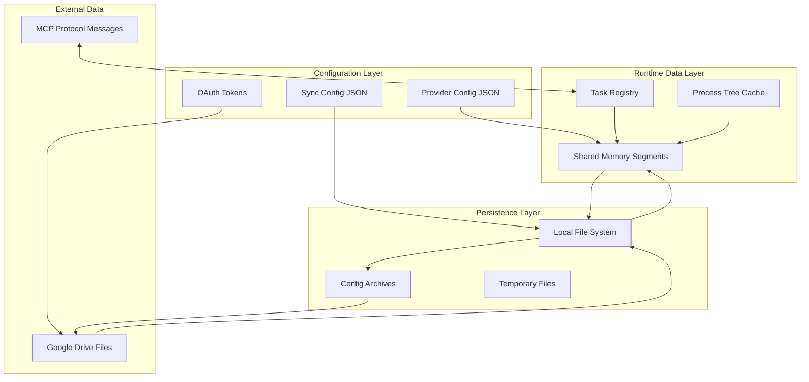

# Data Structure Design - v0.x.x

## Version Information
- Current data version: v0
- Last updated: 2025-11-12
- Based on: Initial development (v0.1.0)

---

## [v0] Data Model Overview

### System Data Flow Architecture



---

## Core Data Structures

### [v0] Configuration Data Models

#### DATA-001: Provider Configuration
**Version**: v0.1.0+
**Related Requirements**: REQ-002
**Storage Location**: `~/.aiw/provider.json`

**Schema Definition**:
```json
{
  "$schema": "https://agentic-warden.dev/schema/provider.json",
  "version": "1.0.0",
  "format_version": 1,
  "default_provider": "openrouter",
  "providers": {
    "openrouter": {
      "name": "OpenRouter",
      "description": "Unified LLM gateway supporting multiple models",
      "compatible_with": ["codex", "claude", "gemini"],
      "env": {
        "OPENAI_API_KEY": "sk-or-v1-...",
        "OPENAI_BASE_URL": "https://openrouter.ai/api/v1",
        "OPENAI_ORGANIZATION": ""
      },
      "builtin": false,
      "created_at": "2025-11-08T00:00:00Z",
      "updated_at": "2025-11-12T00:00:00Z",
      "metadata": {
        "website": "https://openrouter.ai",
        "pricing_url": "https://openrouter.ai/pricing",
        "models": ["gpt-4", "claude-3-opus", "gemini-pro"]
      }
    }
  },
  "settings": {
    "auto_refresh": true,
    "health_check_interval": 300,
    "connection_timeout": 30,
    "max_retries": 3,
    "validate_on_startup": true
  }
}
```

**Validation Rules**:
- `name`: Required, unique, alphanumeric + hyphens
- `compatible_with`: At least one AI CLI type must be specified
- `env`: All environment variables must have non-empty values
- `metadata`: Optional free-form JSON object

**Rust Implementation**:
```rust
#[derive(Debug, Clone, Serialize, Deserialize)]
pub struct ProviderConfig {
    pub schema: String,
    pub version: String,
    pub format_version: u32,
    pub providers: HashMap<String, Provider>,
    pub default_provider: String,
    pub settings: ProviderSettings,
}

#[derive(Debug, Clone, Serialize, Deserialize)]
pub struct Provider {
    pub name: String,
    pub description: String,
    pub compatible_with: Vec<AiType>,
    pub env: HashMap<String, String>,
    pub builtin: bool,
    pub created_at: DateTime<Utc>,
    pub updated_at: DateTime<Utc>,
    pub metadata: HashMap<String, serde_json::Value>,
}
```

#### DATA-002: Synchronization Configuration
**Version**: v0.1.0+
**Related Requirements**: REQ-003
**Storage Location**: `~/.aiw/sync.json`

**Schema Definition**:
```json
{
  "config": {
    "directories": [
      "~/.claude",
      "~/.codex",
      "~/.gemini"
    ],
    "auto_sync_enabled": false,
    "sync_interval_minutes": 60
  },
  "state": {
    "directories": {
      "~/.claude": {
        "hash": "sha256:abc123...",
        "file_count": 15,
        "total_size": 2048576,
        "timestamp": "2025-11-12T10:30:00Z"
      }
    },
    "last_sync": "2025-11-12T10:30:00Z",
    "version": 1,
    "network_status": {
      "available": true,
      "proxy_detected": false,
      "last_checked": "2025-11-12T10:25:00Z"
    },
    "network_last_checked": "2025-11-12T10:25:00Z"
  }
}
```

#### DATA-003: OAuth Token Information
**Version**: v0.1.0+
**Related Requirements**: REQ-003
**Storage Location**: `~/.aiw/auth.json`

**Schema Definition**:
```json
{
  "token_info": {
    "access_token": "ya29.a0AfH6SMC...",
    "refresh_token": "1//0g tq...",
    "token_type": "Bearer",
    "expires_in": 3600,
    "expiry_time": "2025-11-12T11:30:00Z",
    "obtained_at": "2025-11-12T10:30:00Z",
    "scope": "https://www.googleapis.com/auth/drive.file"
  },
  "device_code": {
    "device_code": "CM-8_w4...",
    "user_code": "ABCD-EFGH",
    "verification_url": "https://www.google.com/device",
    "expires_in": 1800,
    "interval": 5
  }
}
```

---

### [v0] Runtime Data Models

#### DATA-004: Task Registry Record
**Version**: v0.1.0+
**Related Requirements**: REQ-001, REQ-005
**Storage**: Shared Memory (transient)

**Rust Implementation**:
```rust
#[derive(Debug, Clone, Serialize, Deserialize)]
pub struct TaskRecord {
    pub task_id: TaskId,
    pub pid: u32,
    pub root_parent_pid: u32,
    pub ai_cli_type: Option<AiType>,
    pub prompt: String,
    pub provider: Option<String>,
    pub status: TaskStatus,
    pub start_time: DateTime<Utc>,
    pub end_time: Option<DateTime<Utc>>,
    pub result: Option<String>,
    pub error: Option<String>,
    pub command_line: String,
    pub working_directory: PathBuf,
}

#[derive(Debug, Clone, Serialize, Deserialize, PartialEq)]
pub enum TaskStatus {
    Running,
    CompletedButUnread,
    Completed,
    Failed,
}

#[derive(Debug, Clone, Copy, PartialEq, Eq, Hash, Serialize, Deserialize)]
pub struct TaskId(u64);
```

**Shared Memory Layout**:
```rust
// Namespace format: "agentic-warden-{root_pid}_task"
pub struct SharedMemoryLayout {
    pub version: u32,
    pub created_at: DateTime<Utc>,
    pub tasks: HashMap<TaskId, TaskRecord>,
    pub metadata: HashMap<String, serde_json::Value>,
}
```

#### DATA-005: Process Tree Information
**Version**: v0.1.0+
**Related Requirements**: REQ-001
**Storage**: In-memory with shared memory caching

**Rust Implementation**:
```rust
#[derive(Debug, Clone, Serialize, Deserialize)]
pub struct ProcessTreeInfo {
    pub process_chain: Vec<u32>,
    pub root_parent_pid: Option<u32>,
    pub depth: usize,
    pub has_ai_cli_root: bool,
    pub ai_cli_type: Option<String>,
    pub ai_cli_process: Option<AiCliProcessInfo>,
}

#[derive(Debug, Clone, Serialize, Deserialize)]
pub struct AiCliProcessInfo {
    pub pid: u32,
    pub ai_type: String,
    pub process_name: String,
    pub command_line: String,
    pub is_npm_package: bool,
    pub detected_at: DateTime<Utc>,
    pub executable_path: Option<PathBuf>,
}
```

**Cache Structure**:
```rust
// Process tree detection results cached for 5 seconds
static ROOT_PARENT_PID_CACHE: OnceLock<HashMap<u32, ProcessTreeInfo>> = OnceLock::new();
```

---

### [v0] External Integration Data Models

#### DATA-006: Google Drive File Metadata
**Version**: v0.1.0+
**Related Requirements**: REQ-003
**Storage**: Google Drive API

**Rust Implementation**:
```rust
#[derive(Debug, Clone, Serialize, Deserialize)]
pub struct DriveFile {
    pub id: String,
    pub name: String,
    pub size: Option<i64>,
    pub mime_type: String,
    pub created_time: Option<DateTime<Utc>>,
    pub modified_time: Option<DateTime<Utc>>,
    pub parents: Option<Vec<String>>,
    pub web_view_link: Option<String>,
    pub web_content_link: Option<String>,
}

// API Response wrappers
#[derive(Debug, Deserialize)]
struct DriveFileResponse {
    id: String,
    name: String,
    size: Option<String>,
    #[serde(rename = "mimeType")]
    mime_type: String,
    #[serde(rename = "createdTime")]
    created_time: Option<String>,
    #[serde(rename = "modifiedTime")]
    modified_time: Option<String>,
    parents: Option<Vec<String>>,
}
```

#### DATA-007: MCP Protocol Messages
**Version**: v0.1.0+
**Related Requirements**: REQ-007
**Storage**: Stdio transport (transient)

**JSON-RPC Message Structure**:
```json
{
  "jsonrpc": "2.0",
  "id": "req-001",
  "method": "tools/call",
  "params": {
    "name": "start_ai_cli",
    "arguments": {
      "ai_type": "claude",
      "prompt": "Write a Rust function",
      "provider": "openrouter"
    }
  }
}
```

**Tool Definitions**:
```rust
#[derive(Debug, Serialize, Deserialize)]
pub struct MCPTool {
    pub name: String,
    pub description: String,
    pub input_schema: serde_json::Value,
}

// Available tools
pub const MCP_TOOLS: &[&str] = &[
    "monitor_processes",
    "get_process_tree",
    "terminate_process",
    "get_provider_status",
    "start_ai_cli",
];
```

---

## Database Schema (NoSQL)

### [v0] File-based Data Organization

#### Configuration Directory Structure
```
~/.aiw/
├── provider.json              # Provider configurations (DATA-001)
├── sync.json                  # Synchronization state (DATA-002)
├── auth.json                  # OAuth tokens (DATA-003)
├── config.json                # Main application config
└── schema/                    # JSON Schema validation
    ├── provider.json.schema
    ├── sync.json.schema
    └── auth.json.schema
```

#### Runtime Data Organization
```
<TEMP>/.aiw/         # System temp directory
├── agentic-warden.log          # Application logs
├── temp/                       # Temporary files
│   ├── oauth_callback.html     # OAuth callback page
│   └── download_cache/         # Drive download cache
└── shared-memory/              # Shared memory segments (OS managed)
    ├── agentic-warden-1234_task    # Process 1234 namespace
    ├── agentic-warden-5678_task    # Process 5678 namespace
    └── agentic-warden-mcp_task     # MCP server namespace
```

#### Google Drive Organization
```
Google Drive Root/
└── agentic-warden/                     # Application folder
    ├── configs/                        # Configuration archives
    │   ├── claude-config-20251112.tar.gz
    │   ├── codex-config-20251112.tar.gz
    │   └── gemini-config-20251112.tar.gz
    └── metadata.json                   # Sync metadata
```

---

## Data Change History

### DATA-001: Initial Provider Configuration Schema
**Date**: 2025-11-08
**Version**: v0.1.0
**Type**: Add Schema
**Related**: REQ-002, ARCH-002

**Change Description**:
- Defined Provider configuration JSON schema
- Added support for multiple providers with environment variables
- Implemented compatibility validation with AI CLI types
- Added metadata and settings structures

**Impact Assessment**:
- Enables dynamic provider switching via `-p` parameter
- Centralizes API key management
- Provides extensibility for new providers
- Risk: Medium (configuration format compatibility)

---

### DATA-002: Task Registry Shared Memory Structure
**Date**: 2025-11-08
**Version**: v0.1.0
**Type**: Add Data Structure
**Related**: REQ-001, REQ-005, ARCH-001

**Change Description**:
- Defined shared memory layout for cross-process task coordination
- Implemented namespace isolation by AI CLI root process
- Added task lifecycle management (Running → Completed)
- Integrated with process tree tracking

**Impact Assessment**:
- Enables sub-millisecond cross-process communication
- Provides real-time task status updates
- Supports 50+ concurrent AI CLI processes
- Risk: High (shared memory complexity, platform differences)

---

### DATA-003: Google Drive Integration Data Models
**Date**: 2025-11-08
**Version**: v0.1.0
**Type**: Add Data Structures
**Related**: REQ-003, ARCH-003

**Change Description**:
- Defined OAuth 2.0 Device Flow token structures
- Implemented Google Drive API response models
- Added configuration archive metadata
- Created sync state tracking with hash validation

**Impact Assessment**:
- Enables cross-device configuration synchronization
- Provides secure token management
- Supports selective configuration packing
- Risk: Low (standard OAuth/Drive APIs)

---

## Data Validation Rules

### Configuration Validation
```yaml
Provider Configuration:
  name:
    - Required: true
    - Format: alphanumeric + hyphens
    - Length: 1-50 characters
  compatible_with:
    - Required: true
    - Min items: 1
    - Allowed: ["codex", "claude", "gemini"]
  env:
    - Required: true
    - All values: non-empty strings
    - Key format: UPPER_CASE with underscores

Sync Configuration:
  directories:
    - Required: true
    - Format: valid filesystem paths
    - Supports tilde expansion
  auto_sync_enabled:
    - Type: boolean
    - Default: false
  sync_interval_minutes:
    - Type: integer
    - Range: 1-1440 (max 24 hours)
```

### Runtime Data Validation
```yaml
Task Record:
  task_id:
    - Type: u64 timestamp-based
    - Unique: true within namespace
  pid:
    - Type: u32
    - Range: 1-4294967295
    - Must be active process
  status:
    - Enum: ["Running", "CompletedButUnread", "Completed", "Failed"]
    - State transitions: Running → Completed/Failed

Process Tree:
  process_chain:
    - Type: Vec<u32>
    - Min length: 1
    - All pids: valid processes
    - No duplicates
  depth:
    - Type: usize
    - Must equal: process_chain.length()
```

---

## Performance Characteristics

### Data Access Patterns

#### Shared Memory Operations
```yaml
Task Registration:
  Latency: < 1ms
  Throughput: 1000+ operations/second
  Concurrency: Lock-free reads, atomic writes

Task Status Updates:
  Latency: < 0.5ms
  Pattern: High write frequency, read on demand
  Consistency: Eventually consistent across processes

Process Tree Detection:
  Latency: 10-100ms (cached: < 1ms)
  Cache TTL: 5 seconds
  Platform: Windows (slower), Unix (faster)
```

#### Configuration Operations
```yaml
Provider Config Load:
  Latency: 5-10ms
  File size: 1-10KB
  Validation: JSON Schema

Sync Archive Creation:
  Latency: 1-5s
  Archive size: 1-5MB (compressed)
  File count: 10-50 files

Google Drive Upload:
  Latency: 5-30s (network dependent)
  Bandwidth: Efficient compression
  Retry: Exponential backoff
```

#### Storage Requirements
```yaml
Baseline Storage:
  Configuration files: < 100KB
  Shared memory: 1MB per active namespace
  Log files: Rotating, max 10MB
  Temp files: Auto-cleanup

Growth Patterns:
  Task records: Linear with active processes
  Sync archives: Linear with configuration changes
  Shared memory: Bounded by active namespaces
```

---

## Error Handling & Recovery

### Data Corruption Scenarios

#### Shared Memory Corruption
```yaml
Detection:
  - Version mismatch
  - Deserialization failures
  - Checksum validation (if implemented)

Recovery:
  - Create new shared memory segment
  - Re-register active processes
  - Lost task data (acceptable for transient state)

Prevention:
  - Atomic operations
  - Process cleanup on exit
  - Graceful shutdown handling
```

#### Configuration File Corruption
```yaml
Detection:
  - JSON parsing errors
  - Schema validation failures
  - Backup file comparison

Recovery:
  - Restore from backup (~/.aiw/backup/)
  - Reset to default configuration
  - User notification and manual intervention

Prevention:
  - Atomic file writes
  - Backup before modifications
  - Schema validation on load
```

#### Sync State Inconsistency
```yaml
Detection:
  - Hash mismatch between local and remote
  - Missing archive files
  - Token expiration

Recovery:
  - Force full synchronization
  - Re-authenticate with OAuth
  - Manual conflict resolution

Prevention:
  - Hash validation before sync
  - Token refresh automation
  - Network error handling
```

---

## [v0] MCP Routing Data Structures

### DATA-012: 智能MCP路由系统数据结构

#### MCP Configuration Data Model

##### mcp.json Configuration Schema
```json
{
  "mcpServers": {
    "git-server": {
      "command": "mcp-server-git",
      "args": ["--repository", "/workspace"],
      "env": {
        "GIT_REPO_PATH": "/workspace"
      }
    },
    "filesystem-server": {
      "command": "mcp-server-filesystem",
      "args": ["/workspace"]
    }
  }
}
```

##### Routing Configuration
The intelligent routing system uses hardcoded configuration constants for routing parameters:
- `DEFAULT_MAX_TOOLS_PER_REQUEST`: 10 - Maximum tools to consider per request
- `DEFAULT_CLUSTERING_THRESHOLD`: 0.7 - Vector similarity threshold for tool clustering
- `DEFAULT_RERANK_TOP_K`: 5 - Number of top candidates to rerank
- `DEFAULT_SIMILARITY_THRESHOLD`: 0.5 - Minimum similarity threshold for tool selection

#### In-Memory Vector Data Structures

##### MemVDB Tool Index Structure
```rust
// MCP Tool Vector Entry
pub struct McpToolVector {
    pub id: String,                    // Unique tool identifier
    pub mcp_server: String,            // MCP server name
    pub tool_name: String,             // Tool display name
    pub description: String,           // Tool description
    pub category: String,              // Tool category
    pub embedding: Vec<f32>,           // Semantic embedding vector
    pub capabilities: Vec<String>,     // Tool capabilities list
    pub health_status: HealthStatus,   // Current health status
    pub metadata: ToolMetadata,        // Additional tool metadata
}

// MCP Method Vector Entry
pub struct McpMethodVector {
    pub id: String,                    // Unique method identifier
    pub mcp_server: String,            // Parent MCP server
    pub tool_name: String,             // Parent tool name
    pub method_name: String,           // Method name
    pub description: String,           // Method description
    pub schema: MethodSchema,          // JSON schema for parameters
    pub examples: Vec<String>,         // Usage examples
    pub embedding: Vec<f32>,           // Semantic embedding vector
    pub availability: Availability,    // Current availability status
    pub metadata: MethodMetadata,      // Additional method metadata
}
```

#### RMCP Client Management Data Structures

##### MCP Connection Pool Structure
```rust
// MCP Server Connection Info
pub struct McpServerConnection {
    pub server_name: String,           // Server identifier
    pub process_id: Option<u32>,       // Running process PID
    pub connection_status: ConnectionStatus,
    pub health_status: HealthStatus,
    pub last_health_check: chrono::DateTime<chrono::Utc>,
    pub tool_count: usize,             // Number of discovered tools
    pub methods: HashMap<String, MethodSchema>, // Cached method schemas
    pub connection_config: ConnectionConfig,
}

// Connection Pool Metrics
pub struct ConnectionPoolMetrics {
    pub active_connections: usize,
    pub healthy_connections: usize,
    pub failed_connections: usize,
    pub total_requests: u64,
    pub average_response_time: f64,
    pub last_updated: chrono::DateTime<chrono::Utc>,
}
```

#### Routing Decision Data Structures

##### Intelligent Routing Request/Response
```rust
// Routing Request
pub struct IntelligentRouteRequest {
    pub user_request: String,          // Original user query
    #[serde(default)]
    pub session_id: Option<String>,    // Optional session context
    #[serde(default)]
    pub max_candidates: Option<usize>, // Maximum candidate tools to consider
    #[serde(default)]
    pub metadata: HashMap<String, String>, // Additional routing metadata
}

// Routing Response
pub struct IntelligentRouteResponse {
    pub success: bool,
    pub confidence: f32,               // Decision confidence (0.0-1.0)
    pub message: String,               // Human readable response message
    pub selected_tool: Option<SelectedRoute>, // Selected tool for execution
    pub result: Option<RouteExecutionResult>, // Execution result if available
    #[serde(default)]
    pub alternatives: Vec<SelectedRoute>,    // Alternative routing options
    #[serde(default)]
    pub conversation_context: Vec<ConversationRecord>, // Relevant conversation history
}

// Route Execution Result
pub struct RouteExecutionResult {
    pub method_name: String,
    pub mcp_server: String,
    pub execution_time: u64,
    pub result_data: serde_json::Value,
    pub error: Option<RouteError>,
}
```

#### LLM Decision Engine Data Structures

##### LLM Analysis Request/Response
```rust
// LLM Tool Selection Request
pub struct LlmAnalysisRequest {
    pub user_query: String,
    pub candidate_tools: Vec<CandidateTool>,
    pub routing_context: RoutingContext,
    pub previous_interactions: Vec<PreviousInteraction>,
}

// LLM Tool Selection Response
pub struct LlmAnalysisResponse {
    pub selected_tool: SelectedTool,
    pub confidence_score: f64,
    pub reasoning: String,             // LLM reasoning explanation
    pub alternative_tools: Vec<AlternativeTool>,
    pub clarification_needed: Option<String>,
}

// Tool Clustering Analysis
pub struct ClusteringAnalysis {
    pub clusters: Vec<ToolCluster>,
    pub similarity_matrix: Vec<Vec<f64>>,
    pub outlier_tools: Vec<OutlierTool>,
    pub clustering_confidence: f64,
}
```

#### Data Validation and Integrity

##### Configuration Validation Schema
```json
{
  "type": "object",
  "properties": {
    "version": {
      "type": "string",
      "pattern": "^\\d+\\.\\d+$"
    },
    "mcpServers": {
      "type": "object",
      "patternProperties": {
        "^[a-zA-Z0-9_-]+$": {
          "type": "object",
          "required": ["command", "description", "category"],
          "properties": {
            "command": {"type": "string", "minLength": 1},
            "args": {
              "type": "array",
              "items": {"type": "string"}
            },
            "description": {"type": "string", "minLength": 1},
            "category": {
              "enum": ["development", "system", "utility", "ai", "other"]
            },
            "enabled": {"type": "boolean"},
            "health_check": {
              "type": "object",
              "properties": {
                "enabled": {"type": "boolean"},
                "interval": {"type": "integer", "minimum": 1},
                "timeout": {"type": "integer", "minimum": 1}
              }
            }
          }
        }
      }
    }
  },
  "required": ["version", "mcpServers"]
}
```

#### Performance Metrics Data Structures

##### Routing Performance Metrics
```rust
// Performance Tracking
pub struct RoutingMetrics {
    pub request_id: String,
    pub timestamp: chrono::DateTime<chrono::Utc>,
    pub user_query_length: usize,
    pub vector_search_time: u64,       // MemVDB search duration
    pub llm_analysis_time: u64,        // LLM decision duration
    pub mcp_execution_time: u64,       // MCP method execution
    pub total_routing_time: u64,       // End-to-end routing time
    pub cache_hit: bool,               // Route cache utilization
    pub confidence_score: f64,
    pub success: bool,
}

// Aggregated Performance Statistics
pub struct RoutingStatistics {
    pub total_requests: u64,
    pub successful_routes: u64,
    pub failed_routes: u64,
    pub average_response_time: f64,
    pub cache_hit_rate: f64,
    pub average_confidence: f64,
    pub most_used_tools: Vec<ToolUsageStats>,
    pub performance_by_category: HashMap<String, CategoryStats>,
}
```

---

### DATA-017: AIW插件市场数据结构
**Version**: v0.7.0
**Related Requirements**: REQ-017
**Storage Location**:
- `~/.aiw/settings.json`
- `~/.aiw/plugins.json`
- `~/.aiw/mcp.json`

#### Plugin Marketplace Configuration

##### Marketplace Metadata Schema

marketplace.json格式（Claude Code标准）：

| 字段 | 类型 | 必填 | 说明 |
|------|------|------|------|
| `name` | String | 是 | 市场名称（kebab-case） |
| `owner.name` | String | 是 | 维护者名称 |
| `owner.email` | String | 否 | 维护者邮箱 |
| `metadata.description` | String | 否 | 市场描述 |
| `metadata.version` | String | 否 | 市场版本 |
| `metadata.pluginRoot` | String | 否 | 插件根目录（默认"./plugins"） |
| `plugins` | Array | 是 | 插件列表 |

##### Plugin Entry Schema

marketplace.json中的插件条目：

| 字段 | 类型 | 必填 | 说明 |
|------|------|------|------|
| `name` | String | 是 | 插件名称（kebab-case） |
| `source` | String/Object | 是 | 插件来源（相对路径或GitHub配置） |
| `description` | String | 否 | 插件描述 |
| `version` | String | 否 | 插件版本 |
| `author.name` | String | 否 | 作者名称 |
| `author.email` | String | 否 | 作者邮箱 |
| `category` | String | 否 | 插件分类 |
| `tags` | Array<String> | 否 | 插件标签 |
| `strict` | Boolean | 否 | 是否要求plugin.json（默认false） |

#### Plugin Manifest Schema

plugin.json格式（Claude Code标准）：

| 字段 | 类型 | 必填 | 说明 |
|------|------|------|------|
| `name` | String | 是 | 插件名称 |
| `version` | String | 是 | 插件版本（semver） |
| `description` | String | 是 | 插件描述 |
| `author` | Object | 是 | 作者信息 |
| `author.name` | String | 是 | 作者名称 |
| `author.email` | String | 否 | 作者邮箱 |
| `homepage` | String | 否 | 主页URL |
| `repository` | String | 否 | 仓库URL |
| `license` | String | 否 | 许可证 |
| `keywords` | Array<String> | 否 | 关键词 |
| `mcpServers` | String/Object | 否 | MCP服务器配置或文件路径 |
| `commands` | String/Array | 否 | 命令路径（AIW忽略） |
| `agents` | String/Array | 否 | 代理路径（AIW忽略） |
| `hooks` | String/Object | 否 | Hooks配置（AIW忽略） |

#### MCP Servers Configuration Schema

.mcp.json格式或内联配置：

| 字段 | 类型 | 必填 | 说明 |
|------|------|------|------|
| `mcpServers` | Object | 是 | MCP服务器配置对象 |
| `mcpServers.<server-name>` | Object | - | 服务器配置 |
| `.command` | String | 是 | 启动命令 |
| `.args` | Array<String> | 是 | 命令参数 |
| `.env` | Object | 否 | 环境变量 |

#### AIW Settings Schema

~/.aiw/settings.json：

| 字段 | 类型 | 必填 | 说明 |
|------|------|------|------|
| `extraKnownMarketplaces` | Object | 否 | 额外市场源配置 |
| `enabledPlugins` | Object | 否 | 插件启用状态 |

##### extraKnownMarketplaces结构

| 字段 | 类型 | 必填 | 说明 |
|------|------|------|------|
| `<marketplace-name>` | Object | - | 市场源配置 |
| `.source` | Object | 是 | 来源配置 |
| `.source.type` | String | 是 | 来源类型（github/local/remote） |
| `.source.repo` | String | 条件 | GitHub仓库（type=github） |
| `.source.url` | String | 条件 | 远程URL（type=remote） |
| `.source.path` | String | 条件 | 本地路径（type=local） |
| `.enabled` | Boolean | 否 | 是否启用（默认true） |

#### Installed Plugins Schema

~/.aiw/plugins.json：

| 字段 | 类型 | 必填 | 说明 |
|------|------|------|------|
| `plugins` | Object | 是 | 已安装插件对象 |
| `plugins.<plugin-id>` | Object | - | 插件安装信息 |
| `.version` | String | 是 | 插件版本 |
| `.installed_at` | Timestamp | 是 | 安装时间（ISO 8601） |
| `.enabled` | Boolean | 是 | 是否启用 |
| `.source` | String | 是 | 来源市场名称 |

#### MCP Configuration Schema

~/.aiw/mcp.json（与Claude Code一致）：

| 字段 | 类型 | 必填 | 说明 |
|------|------|------|------|
| `mcpServers` | Object | 是 | MCP服务器配置 |
| `mcpServers.<server-name>` | Object | - | 服务器配置 |
| `.command` | String | 是 | 启动命令（npx/node/python等） |
| `.args` | Array<String> | 是 | 命令参数列表 |
| `.env` | Object | 否 | 环境变量映射 |

#### Cache Data Schema

##### 市场源缓存

~/.aiw/cache/market/<marketplace-name>/：

| 文件/目录 | 类型 | 说明 |
|----------|------|------|
| `.claude-plugin/marketplace.json` | File | 市场配置文件 |
| `plugins/<plugin-name>/.claude-plugin/plugin.json` | File | 插件清单 |
| `plugins/<plugin-name>/.mcp.json` | File | MCP配置 |
| `.last_update` | File | 最后更新时间戳 |

##### 插件缓存

~/.aiw/cache/plugins/<plugin-name>@<marketplace>/：

| 文件/目录 | 类型 | 说明 |
|----------|------|------|
| `.claude-plugin/` | Directory | 插件根目录 |
| `.claude-plugin/plugin.json` | File | 插件清单 |
| `.mcp.json` | File | MCP配置 |
| `README.md` | File | 插件文档 |
| `.installed_at` | File | 安装时间戳 |

#### Environment Variable Schema

插件环境变量定义（从.mcp.json或plugin.json解析）：

| 字段 | 类型 | 必填 | 说明 |
|------|------|------|------|
| `name` | String | 是 | 环境变量名称 |
| `description` | String | 否 | 变量说明 |
| `required` | Boolean | 是 | 是否必需 |
| `link` | String | 否 | 获取链接 |

#### Migration Data Schema

从旧配置迁移：

| 源文件 | 目标文件 | 迁移策略 |
|--------|---------|---------|
| `~/.aiw/mcp_servers.yaml` | `~/.aiw/mcp.json` | YAML转JSON，备份原文件 |
| `~/.aiw/registry.yaml` | `~/.aiw/settings.json` | 合并到settings.json |
| 旧MCP配置格式 | 新MCP配置格式 | 转换command/args/env字段 |

---

### DATA-019: 已安装MCP列表数据结构

**数据来源**: `~/.aiw/mcp.json` 中的已安装MCP服务器配置
**访问方式**: McpConfigManager::read()
**用途**: InstalledMcpScreen列表显示和搜索

#### 列表数据结构

| 字段 | 类型 | 必填 | 说明 |
|------|------|------|------|
| name | String | 是 | MCP服务器名称（唯一标识） |
| description | String | 否 | 服务器描述 |
| source | String | 是 | 来源标识（github/local/manual） |
| enabled | bool | 是 | 是否启用该MCP |
| command | String | 是 | 启动命令 |
| env_vars | HashMap<String, String> | 否 | 环境变量配置 |
| created_at | timestamp | 否 | 创建时间 |

#### 派生字段（UI显示）

| 字段 | 类型 | 说明 |
|------|------|------|
| env_var_count | usize | 环境变量数量（从env_vars.len()派生） |
| status_text | String | 状态显示（"Enabled"/"Disabled"） |
| source_icon | char | 来源图标（📦/📁/✏️） |

#### ListState管理

| 属性 | 类型 | 说明 |
|------|------|------|
| selected_index | usize | 当前选中项目索引 |
| scroll_offset | usize | 滚动偏移量 |
| filtered_items | Vec<usize> | 搜索过滤后的项目索引 |
| search_query | String | 当前搜索字符串 |
| search_mode | bool | 是否处于搜索模式 |

#### 搜索过滤规则

- **搜索范围**: name, description字段
- **搜索方式**: 包含匹配（case-insensitive）
- **实时更新**: 每次输入/删除字符后更新filtered_items
- **保留原序**: 搜索结果保持原始顺序

---

### DATA-020: MCP环境变量编辑状态数据结构

**数据来源**: InstalledMcpScreen选中的MCP项目
**访问方式**: 从mcp.json加载指定服务器配置
**用途**: EditEnvState中的变量编辑和保存

#### 编辑状态结构

| 字段 | 类型 | 必填 | 说明 |
|------|------|------|------|
| server_name | String | 是 | 正在编辑的MCP服务器名称 |
| original_values | HashMap<String, String> | 是 | 原始环境变量值（编辑前备份） |
| current_values | HashMap<String, String> | 是 | 当前修改的环境变量值 |
| modified | bool | 是 | 是否有未保存的修改 |
| env_specs | Vec<EnvVarSpec> | 是 | 环境变量规格列表（从MCP配置加载） |

#### EnvVarSpec（环境变量规格）

| 字段 | 类型 | 必填 | 说明 |
|------|------|------|------|
| name | String | 是 | 变量名称 |
| required | bool | 是 | 是否为必填变量 |
| description | String | 否 | 变量说明 |
| default_value | Option<String> | 否 | 默认值 |
| validation_rule | Option<String> | 否 | 验证规则（如正则表达式） |

#### 编辑操作状态

| 操作 | 前置条件 | 后置状态 | 说明 |
|------|----------|---------|------|
| 进入编辑模式 | 已选中MCP项目 | modified=false | 加载原值，重置modified |
| 修改变量值 | 在EnvInputState中修改 | modified=true | 跟踪用户输入 |
| 按's'确认保存 | modified=true | 等待确认 | 显示确认对话框 |
| 确认保存 | 用户选择'y' | 保存到mcp.json | 调用McpConfigManager::update_server() |
| 取消编辑 | 按'Esc' | 放弃修改 | 返回列表，不保存 |

#### 保存验证规则

| 验证项 | 规则 | 失败处理 |
|--------|------|---------|
| 必填变量 | 所有required字段必须有值 | 显示错误，不允许保存 |
| JSON序列化 | 修改后的值需成功序列化为JSON | 显示错误，保留编辑状态 |
| 文件写入 | mcp.json成功写入 | 显示错误，保留备份 |

#### 错误处理

| 错误类型 | 触发条件 | 用户提示 |
|----------|----------|----------|
| 变量验证失败 | 必填字段为空 | "Required: {var_name}" |
| JSON错误 | 值序列化失败 | "Invalid value for {var_name}" |
| 文件写入失败 | mcp.json不可写 | "Failed to save config: {error}" |
| 配置缺失 | MCP配置文件损坏 | "Server configuration not found" |

---

## Deprecated Data Structures

### Historical Data Models (Not applicable for v0)

*Note: This is the initial data structure version. Future deprecated data models will be documented here when schema changes are made.*

**Migration Strategy**: When future data model changes are required:
1. Version bump in schema files
2. Backward compatibility layer
3. Automated migration scripts
4. User notification for breaking changes